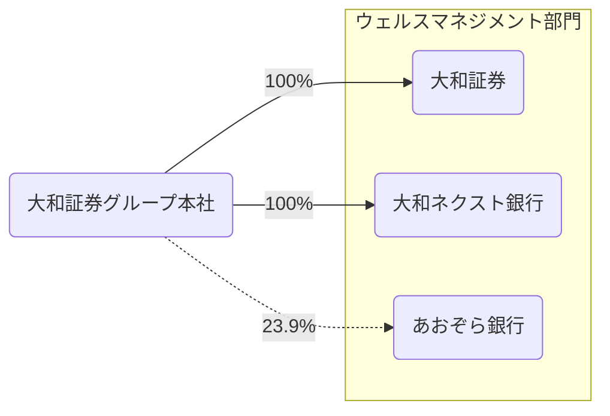
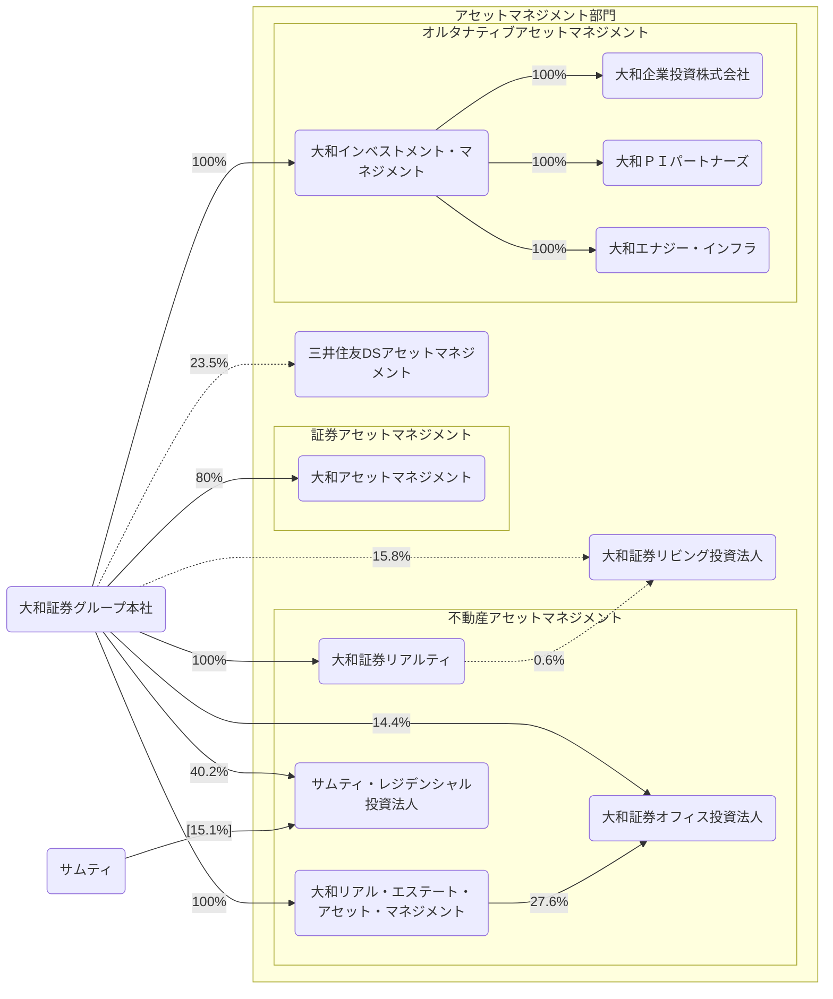
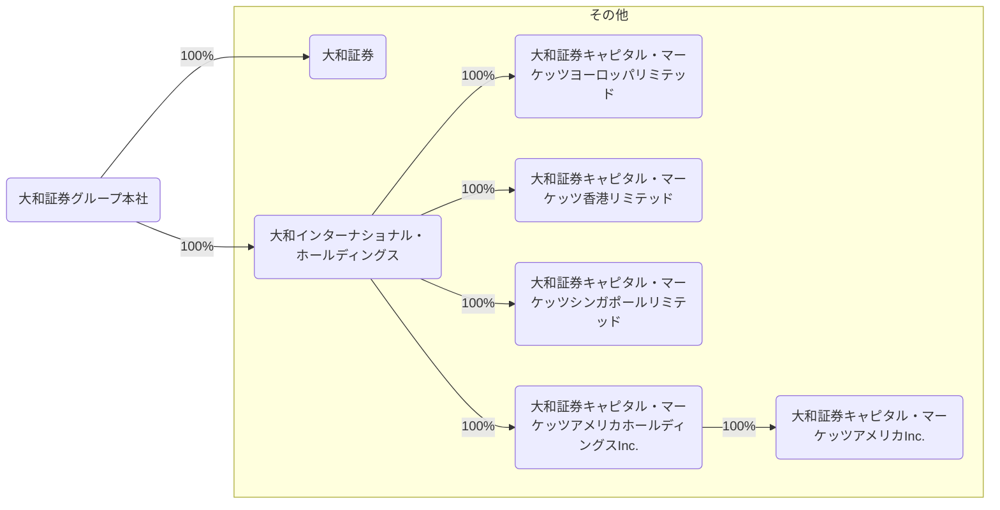
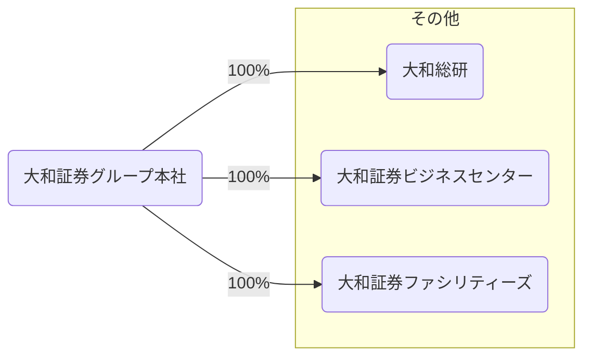

2026/03の有価証券報告書をもとに大和証券グループ本社を見る。

## データの出典
会社のホームページ又はEDINET閲覧（提出）サイト（https://disclosure2.edinet-fsa.go.jp/week0010.aspx）に提出された有価証券報告書より抜粋して作成
- [有価証券報告書](https://www.daiwa-grp.jp/ir/toolkit/report.html)

## 部門
> 当社グループは個々の連結子会社及び持分法適用関連会社を基礎とした顧客マーケット・業態別のセグメントから構成されており、経済的特徴が概ね類似しているセグメントを集約した「ウェルスマネジメント部門」、「アセットマネジメント部門」及び「グローバル・マーケッツ＆インベストメント・バンキング部門」

### ウェルスマネジメント部門
> 主に個人や未上場法人のお客様に幅広い金融商品・サービスを提供しております。

### アセットマネジメント部門
> さまざまな資産を投資対象とした投資信託の設定・運用を行っているほか、国内外の機関投資家に対し投資助言・運用サービスを提供すると共に、不動産を投資対象とした投資法人・ファンドの運用を行っております。また、金銭債権、プライベート・エクイティ、ベンチャーキャピタル、不動産、再生可能エネルギー、インフラなどの資産に投資を行っているほか、既存案件における投資回収の極大化や、新規投資ファンドの組成を中心としたビジネスを行っております。

### グローバル・マーケッツ＆インベストメント・バンキング部門
> グローバル・マーケッツ及びグローバル・インベストメント・バンキングで構成されており、グローバル・マーケッツは、主に国内外の機関投資家や事業法人、金融法人、公共法人等のお客様向けに、株式、債券・為替及びそれらの派生商品のセールス及びトレーディングを行っております。グローバル・インベストメント・バンキングは、国内外における有価証券の引受け、M&Aアドバイザリー等、多様なインベストメント・バンキング・サービスを提供しております。

## 2025年度の取り組み
### ウェルスマネジメント部門
大和証券
> １．当期も引き続き、お客様の資産状況やニーズなどのヒアリングを踏まえ、最適なポートフォリオ提案やソリューション提案を実践しました。これらの取組みにより、資産導入額は2007年以来の高水準、ラップ口座サービスの契約金額および株式投資信託の純増額は過去最高を記録するなど、顧客基盤の拡充およびマーケット環境に左右されにくい収益基盤の構築が進展しました。

> ２．多様なお客様のニーズに応えられるよう、高度化するお客様のニーズに応えるべく、特定投資家向け銘柄制度（J-ships）の取扱い協会員として指定を受けるなど、商品・サービス・ソリューションの拡充に取り組みました。

> ３．グループ連携プラットフォームとして、資産管理および投資に関する情報を提供するスマートフォンアプリ「D-Port」を導入し、デジタル・営業店・コンタクトセンターが三位一体の体制となって、顧客に応じたアプローチを行う体制づくりに努めました。

> ４．株式会社ゆうちょ銀行に提供している「ゆうちょファンドラップ」に加え、株式会社あおぞら銀行を含む４行において「みらい彩りラップ」の取扱いを開始するなど外部提携の拡大にむけた取組みを強化しました。その結果、提携先経由でのファンドラップの契約残高は大きく増加しています。さらに、2026年４月より、株式会社岩手銀行との協業を開始するなど、顧客基盤の拡大を着実に進めています。

大和ネクスト銀行
> １．円預金について、金利環境の変化を踏まえた競争力のある金利水準を提供するとともに、預金残高の安定的な積み上げに取り組みました。外貨預金においても業界トップ水準の金利を維持し、各種キャンペーンの実施等を通じて新規預金の獲得を図りました。

> ２．大和証券との連携のもと、お客様の資産運用・資金ニーズを踏まえた商品・サービスの提供を行うなど、証銀連携の取り組みを通じてグループ内連携の強化を進めました。

> ３．国内外の金利環境及び市場動向を踏まえ、ポートフォリオの見直しや運用手法の高度化を進めるとともに、貸出や有価証券投資を通じた投融資に取り組み、収益機会の確保を図りました。

> ４．応援定期預金の提供を継続するとともに、サステナビリティKPIの一つである、ESG投融資について、残高維持に向けた取り組みを行いました。

### アセットマネジメント部門
> １．大和アセットマネジメントでは商品ブランドのマーケティングに注力し、iFreeシリーズやオルタナティブ商品への好調な資金流入により運用資産残高は過去最高水準となりました。

> ２．2025年７月に、大和アセットマネジメントは三井物産オルタナティブインベストメンツ株式会社（新商号：大和かんぽオルタナティブインベストメンツ株式会社）を子会社化し、オルタナティブ資産運用分野へ本格参入しました。

> ３．大和リアル・エステート・アセット・マネジメントでは運用する私募REITの物件取得や私募ファンドの運用受託を通じて運用資産残高が増加しました。

> ４．大和ＰＩキャピタルでは運営するプライベート・エクイティファンドにおいて飲食ビジネスを中心に投資を実行しました。大和企業投資では、「大和日台バイオベンチャー3号投資事業有限責任組合」を設立しました。

### グローバル・マーケッツ＆インベストメント・バンキング部門
> １．引受ビジネス、M&Aの取組みとして、株式の非公開化や政策保有株式の売却、金利上昇局面における前倒し負債調達、業界再編、といったお客様の多様なニーズを的確に捉えた提案を行い、案件の獲得に取り組みました。

> ２．ウェルスマネジメント部門との連携強化として、外国株の売買代金・預り残高の拡大やポートフォリオ提案の推進など外貨資産領域に注力しました。

> ３．未上場企業のお客様に対してIPOに留まらない多様なソリューションを提供し、国内外M&Aビジネスにおいては、効率的な収益拡大のためにアドバイザリーサービスの高付加価値化に取り組みました。

> ４．グローバル・インベストメント・バンキングでは、テーマ別でのアプローチや大型案件に注力することで収益性の向上に取り組みました。グローバル・マーケッツでは、海外投資家からの継続的な日本株への関心の高さを背景とした体制強化など、お客様ニーズに合わせたリソースの再配分を進め、収益向上を図りました。

> グローバル・マーケッツのエクイティ収益は、好調な株式市場を背景に機関投資家及び個人投資家の日本株フローが拡大したことに加え、個人投資家の外国株の売買が増加基調となったことにより、増収となりました。フィクスト・インカム収益は、国内において金利上昇を背景に機関投資家のポートフォリオ入れ替えニーズが強まり、増収となりました。海外においても米国金利の高いボラティリティの影響により増収となりました。

> グローバル・インベストメント・バンキングでは、株式会社コーエーテクモホールディングス、信越化学工業株式会社の株式売出しや株式会社JVCケンウッドによる転換社債型新株予約権付社債及びKDDI株式会社による普通社債などで主幹事を務めたほか、伊藤忠商事株式会社による本邦初となるオレンジボンドの引受における主幹事及びStructuring Agentを務めました。

> M&Aアドバイザリー業務では、NTT株式会社による株式会社NTTデータの完全子会社化、パラマウントベッドホールディングス株式会社の非上場化、株式会社パロマ・リームホールディングスによるフランスのGroupe Atlanticの株式過半数取得など、多くの案件に関与しました。 

### その他
> １．国内外の経済見通しや金融制度、人的資本経営、サステナビリティ、IT・デジタル技術等に関する調査・分析を行い、レポートや出版物、セミナー等による情報発信や政策提言活動を通じて、プレゼンス向上に寄与しました。

> ２．金融機関や事業法人向けに業務高度化・効率化のソリューションを提供したほか、開発の効率化・期間短縮を進めました。新規事業では、生成AIを活用した自律検証型システムマイグレーションツールやWeb3技術を活用したデジタル証明書サービスの展開を推進しました。

> ３．健康保険組合向け情報管理システム等について、商品性強化やサービス品質向上を目的とした再構築と機能改善を行いました。また、従業員向けの健康支援サービスを正式リリースしたほか、企業および健康保険組合向けのヘルスケアデータ分析支援サービス開発を進めました。

>　大和総研は、当社グループのシステム開発を着実に遂行したほか、高付加価値のソリューション提案により、お客様との関係を強化したこと、また、大口顧客向けシステム開発案件を手掛けたこと等により、当社グループの収益に貢献しました。

## 事業系統図
- 株式会社は省略
- 実線は子会社、点線は持分法適用関連会社を表す
- その他とまとめられている会社は省く
- 保有率は小数第二位を四捨五入
- 図が大きくなりすぎるので事業部門ごとに分ける

### ウェルスマネジメント部門
- あおぞら銀行は主要な事業の内容から推測

### アセットマネジメント部門
- サムティの持分は外書き。大和証券グループ本社と同じくスポンサーをしていることから推測
- 三井住友DSアセットマネジメントと大和証券リビング投資法人は主要な事業の内容から推測

### グローバル・マーケッツ＆インベストメント・バンキング部門

### その他

## 連結貸借対照表
### 資産(2026/03/31)
<canvas data-json="/finance/assets/data/daiwa_sec_group_202603.json" data-date="2026-03-31" data-chart-type="bar" data-name="Balance Sheet" data-side="asset" > </canvas>

### 資産(2025/03/31)
<canvas data-json="/finance/assets/data/daiwa_sec_group_202603.json" data-date="2025-03-31" data-chart-type="bar" data-name="Balance Sheet" data-side="asset" > </canvas>

### 負債・純資産(2026/03/31)
<canvas data-json="/finance/assets/data/daiwa_sec_group_202603.json" data-date="2026-03-31" data-chart-type="bar" data-name="Balance Sheet" data-side="liability"> </canvas>

### 負債・純資産(2025/03/31)
<canvas data-json="/finance/assets/data/daiwa_sec_group_202603.json" data-date="2025-03-31" data-chart-type="bar" data-name="Balance Sheet" data-side="liability"> </canvas>

## 連結損益計算書及び連結包括利益計算書
### 2026/03/31
<canvas data-json="/finance/assets/data/daiwa_sec_group_202603.json" data-date="2026-03-31" data-chart-type="waterfall" data-name="Profit and Loss"> </canvas>

### 2025/03/31
<canvas data-json="/finance/assets/data/daiwa_sec_group_202603.json" data-date="2025-03-31" data-chart-type="waterfall" data-name="Profit and Loss"> </canvas>

## 連結キャッシュ・フロー計算書
### 2026/03/31
<canvas data-json="/finance/assets/data/daiwa_sec_group_202603.json" data-date="2026-03-31" data-chart-type="waterfall" data-name="Cashflow"> </canvas>

### 2025/03/31
<canvas data-json="/finance/assets/data/daiwa_sec_group_202603.json" data-date="2025-03-31" data-chart-type="waterfall" data-name="Cashflow"> </canvas>

