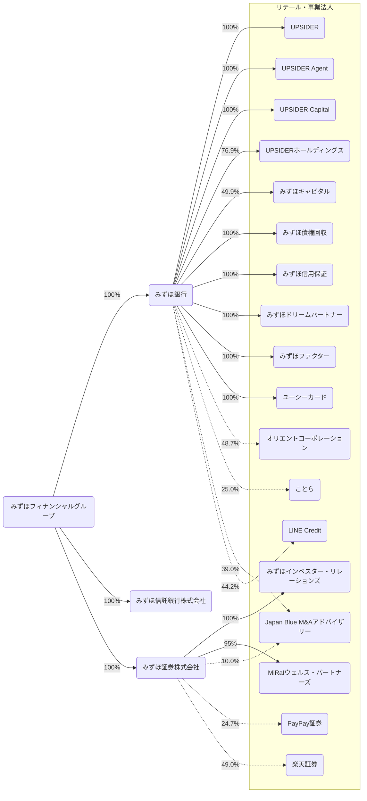
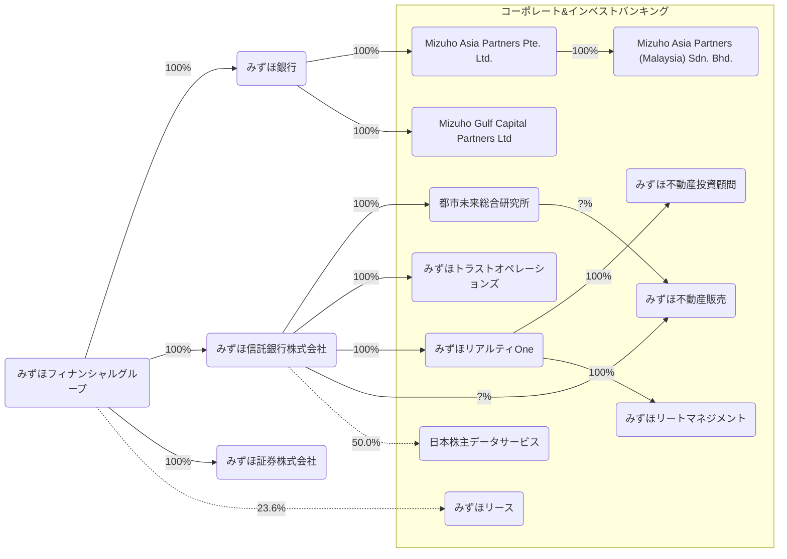
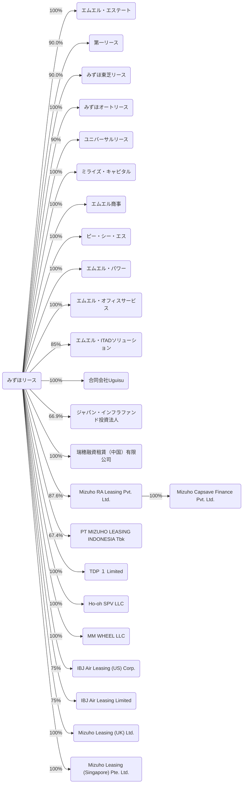
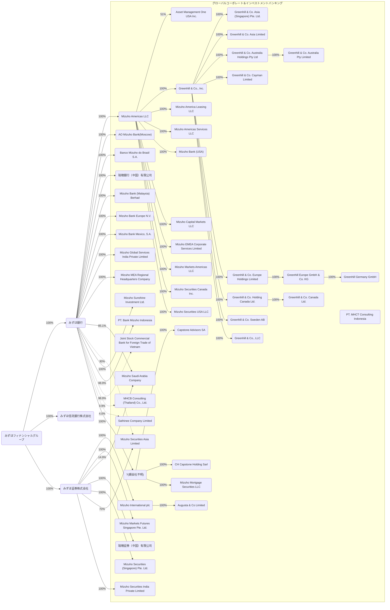
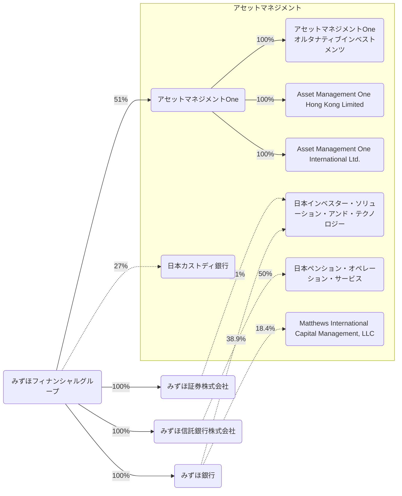
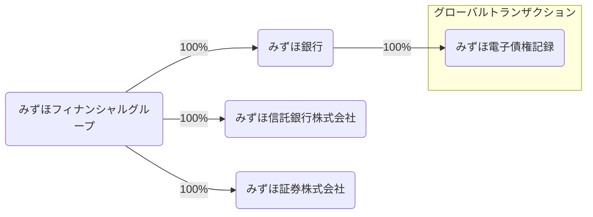
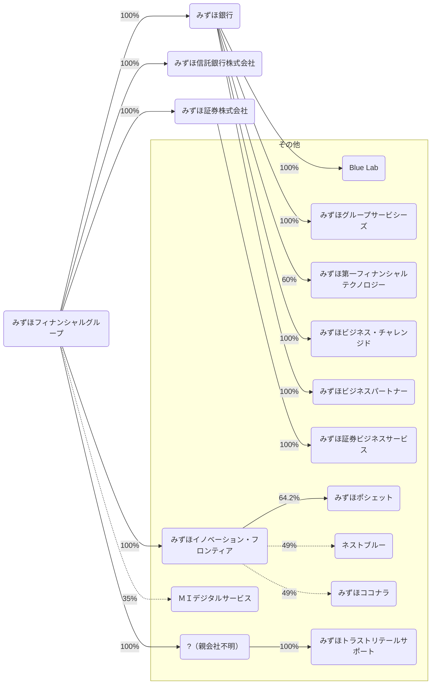

2026/03の有価証券報告書をもとにみずほフィナンシャルグループを見る。

## データの出典
会社のホームページ又はEDINET閲覧（提出）サイト（https://disclosure2.edinet-fsa.go.jp/week0010.aspx）に提出された有価証券報告書より抜粋して作成
- [有価証券報告書](https://www.mizuho-fg.co.jp/investors/financial/report/index.html)
  - みずほフィナンシャルグループ
  - みずほ銀行
- [有価証券報告書/四半期報告書](https://www.mizuho-ls.co.jp/ja/ir/library/securities.html)

## 事業系統図(2026/04/01)
- 株式会社は省略
- 実線は子会社、点線は持分法適用関連会社を表す
- その他とまとめられている会社は省く
- 保有率は小数第二位を四捨五入
- 図が大きくなりすぎるのでカンパニーごとに分ける

### リテール・事業法人カンパニー

### コーポレート＆インベストバンキングカンパニー

みずほリースの連結子会社は次の通り。

### グローバルコーポレート＆インベストメントバンキングカンパニー

### アセットマネジメントカンパニー

### グローバルトランザクションユニット

### その他

## 連結貸借対照表
### 資産(2026/03/31)
<canvas data-json="/finance/assets/data/mizuho_fg_202603.json" data-date="2026-03-31" data-side="asset" > </canvas>

### 資産(2025/03/31)
<canvas data-json="/finance/assets/data/mizuho_fg_202603.json" data-date="2025-03-31" data-side="asset" > </canvas>

### 負債・純資産(2026/03/31)
<canvas data-json="/finance/assets/data/mizuho_fg_202603.json" data-date="2026-03-31" data-side="liability"> </canvas>

### 負債・純資産(2025/03/31)
<canvas data-json="/finance/assets/data/mizuho_fg_202603.json" data-date="2025-03-31" data-side="liability"> </canvas>

## 連結損益計算書及び連結包括利益計算書
### 2026/03/31

### 2025/03/31