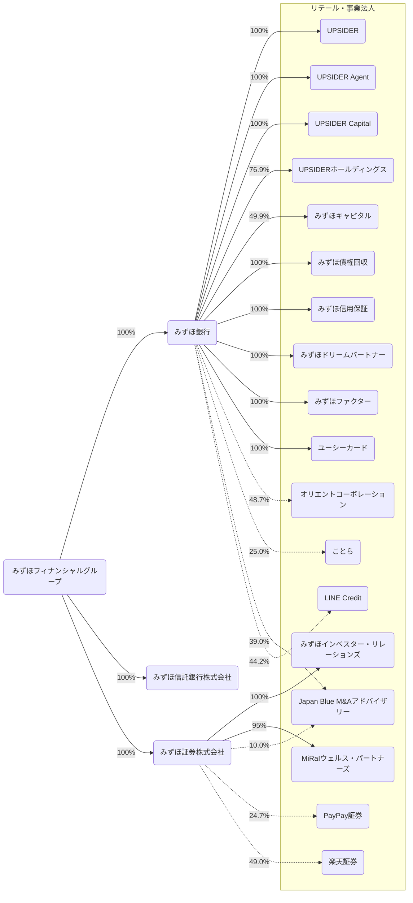
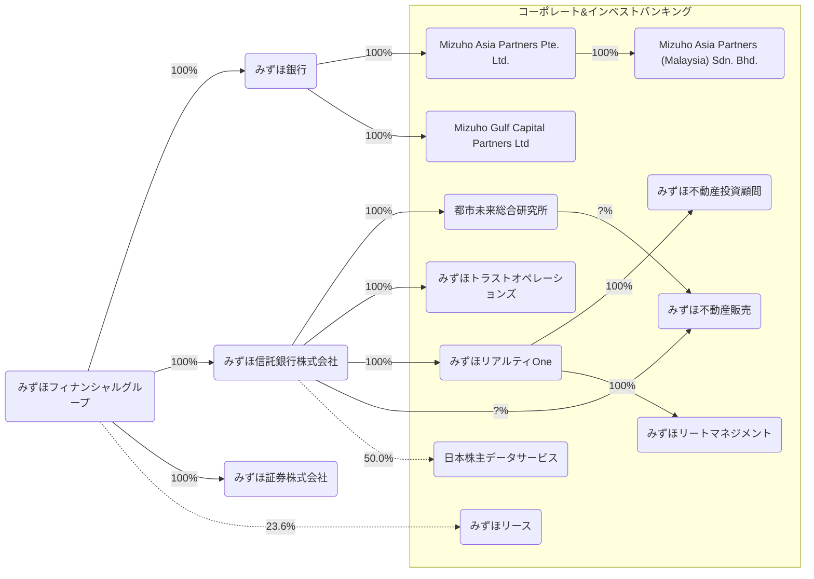
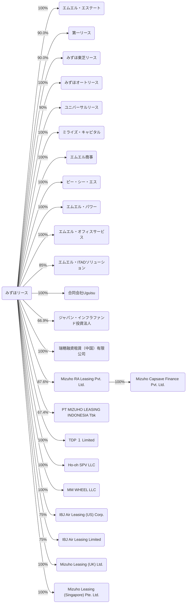
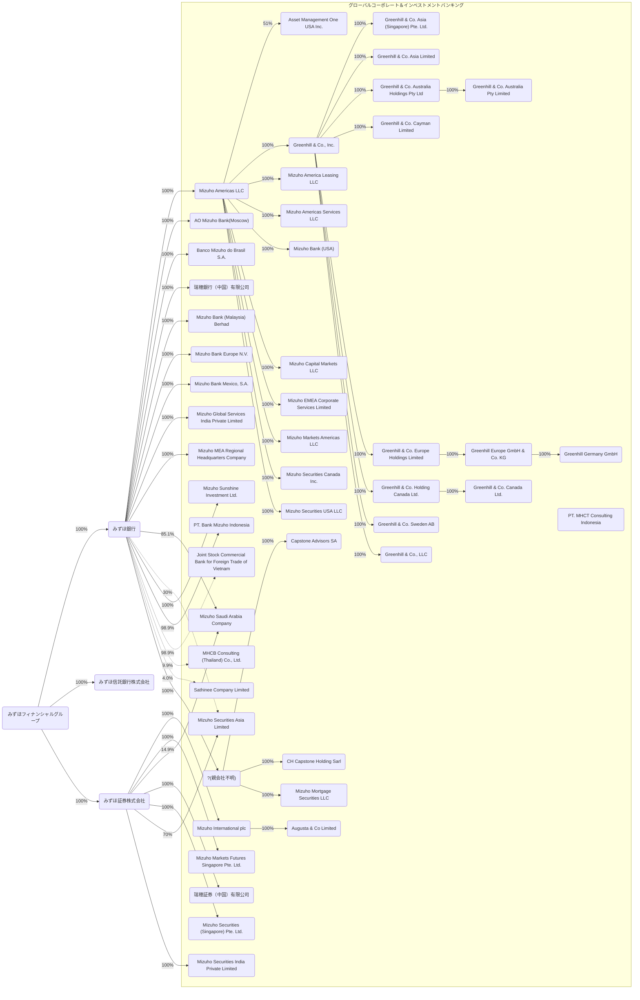
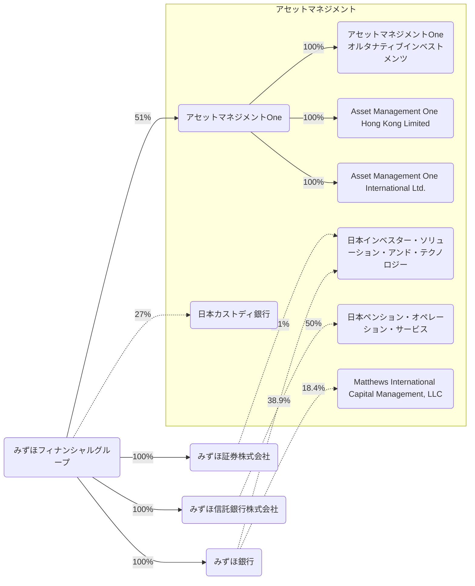
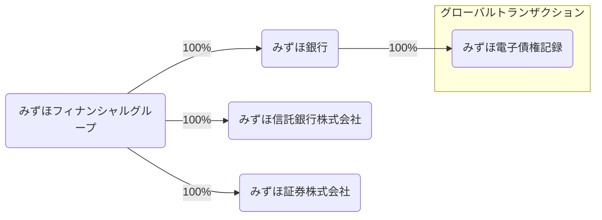
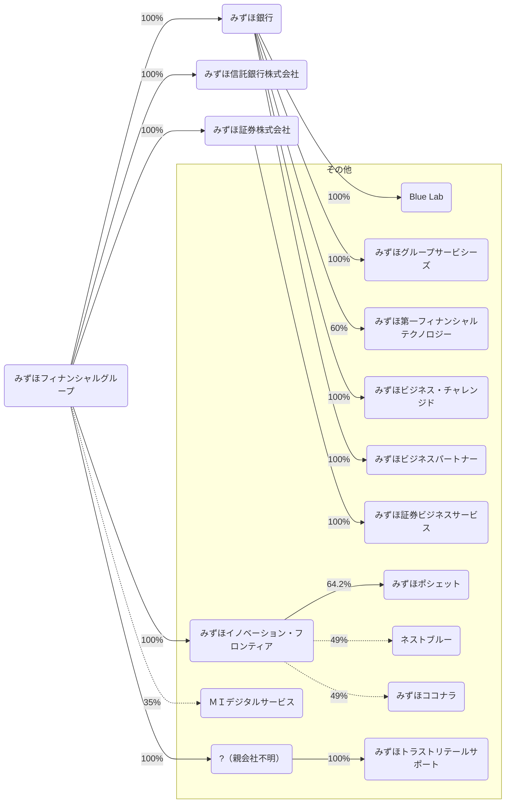

2026/03の有価証券報告書をもとにみずほフィナンシャルグループを見る。

## データの出典
会社のホームページ又はEDINET閲覧（提出）サイト（https://disclosure2.edinet-fsa.go.jp/week0010.aspx）に提出された有価証券報告書より抜粋して作成
- [有価証券報告書](https://www.mizuho-fg.co.jp/investors/financial/report/index.html)
  - みずほフィナンシャルグループ
  - みずほ銀行
- [有価証券報告書/四半期報告書](https://www.mizuho-ls.co.jp/ja/ir/library/securities.html)

## カンパニー・ユニット
> お客さまの属性に応じた銀行・信託・証券等グループ横断的な戦略を策定・推進する５つのカンパニーと、全カンパニー横断的に機能を提供する２つのユニット

### リテール・事業法人カンパニー
> 個人・中小企業・中堅企業の顧客セグメントを担当するカンパニーとして、銀行・信託・証券等グループ一体となったコンサルティング営業や、先進的な技術の活用や他社との提携等を通じた利便性の高い金融・非金融サービスの提供等に取り組んでおります。

> デジタル・リモート・リアルのそれぞれのチャネルの利便性向上や、楽天グループをはじめとしたアライアンス先とのオープンな協業による新たな価値提供を通じ、顧客基盤の持続的な拡大に取り組んでいきます。

> 2025年９月19日に、株式会社みずほ銀行は、株式会社UPSIDERホールディングスの株式を取得し、株式会社みずほ銀行の連結子会社といたしました。当社グループと株式会社UPSIDERホールディングスは、技術力、ノウハウ、顧客基盤、ネットワーク等を融合させることで、日本企業の課題解決や成長支援をさらに加速できるとの共通認識のもと、一体的なサービス・ソリューションの提供、AIと人の共創による新たな与信モデルの構築、オープンなエコシステムの創造を軸に取り組みを強化していきます。

> 2026年５月15日に、株式会社みずほ銀行は、ムニノバホールディングス株式会社ならびに株式会社オリエントコーポレーションとの３社で業務提携契約を締結しました。また、株式会社みずほ銀行は、保有する株式会社オリエントコーポレーションの株式について、議決権の15％相当をムニノバホールディングス株式会社に譲渡する株式譲渡契約を締結しました。３社のそれぞれの強みを最大限にいかし、ノンバンクと銀行取引のシームレスな接続の実現に向けて検討をしていくことに合意しました。

> 2026年５月20日に、株式会社みずほ銀行および楽天銀行株式会社は、メガバンクとデジタルバンクによる、新たな信用創造モデルを確立することを目的として、戦略的な資本業務提携契約を締結しました。株式会社みずほ銀行が対応する法人のお客さま等の資金調達ニーズと楽天銀行株式会社の個人預金を結び付ける様々な施策を行うことが可能となり、株式会社みずほ銀行のオリジネーション力強化と楽天銀行株式会社の運用資産多様化を実現しつつ、企業価値向上、さらには、日本経済そのものの発展に貢献できるものと考えております。

### コーポレート＆インベストメントバンキングカンパニー
> 国内の大企業法人・金融法人・公共法人の顧客セグメントを担当するカンパニーとして、お客さまの金融・非金融に関するニーズに対し、M&Aや不動産関連ビジネス等の投資銀行プロダクツ機能を通じて、お客さまごとのオーダーメード型ソリューションをグループ横断的に提供しております。

### グローバルコーポレート＆インベストメントバンキングカンパニー
> 海外の日系企業および非日系企業等を担当するカンパニーとして、お客さまの事業への深い理解と、銀証連携を軸としたグループ一体でのソリューション提供により、産業の変化・事業構造のトランスフォームを支える金融機能の発揮をめざしてまいります。

> 2025年12月17日に、みずほ証券株式会社は、関連当局の認可等の取得を前提として、Avendus Capital Private Limitedの主要株主との間で、当該主要株主から同社の株式の60%超を取得することに合意し、株式取得に係る契約を締結しました。株式取得の実行後、同社はみずほ証券株式会社の連結子会社となる予定です。当社グループのグローバルな知見と、Avendus Capital Private Limitedのインドにおける専門性を融合させ、「企業の“事業戦略”に強い〈みずほ〉」として、お客さまとともに挑戦し続けます。

### グローバルマーケッツカンパニー
> お客さまのヘッジ・運用ニーズに対してマーケット商品全般を提供するセールス＆トレーディング業務、資金調達やポートフォリオ運営等のALM・投資業務を担当しております。銀行・信託・証券の連携やCIB（コーポレート＆インベストメントバンキング）アプローチにより、マーケッツの知見をいかした〈みずほ〉にしかできないソリューション・プロダクトの提供をめざしてまいります。

### アセットマネジメントカンパニー
> アセットマネジメントに関連する業務を担当するカンパニーとして、銀行・信託・証券およびアセットマネジメントOne株式会社が一体となって、個人から機関投資家まで、幅広いお客さまの資産運用ニーズに応じた商品やサービスを提供しております。

> 2025年10月２日に、当社は、ステート・ストリート・コーポレーションと、当社グループのグローバル・カストディおよび日本国外の関連事業についての譲渡手続を完了したことを発表しました。

### グローバルトランザクションユニット
> 幅広いセグメントのお客さまに向けた、トランザクション分野のソリューション提供業務を担うユニットとして、国内外決済や資金管理、証券管理等、各プロダクツに関する高い専門性を発揮し、高度化・多様化するお客さまのニーズに応えることをめざしてまいります

### リサーチ＆コンサルティングユニット
> 産業からマクロ経済まで深く分析するリサーチ機能と、環境・エネルギー等の社会課題の解決支援からお客さまの経営・人事・事業戦略の策定支援にわたるコンサルティング機能を担うユニットとして、各カンパニーと緊密に連携し、グループ一体となってお客さまや社会に対する価値創造の拡大をめざします。

> また、2026年４月１日に完了した株式会社みずほ銀行とみずほリサーチ＆テクノロジーズ株式会社の統合を梃子にグループ一体運営を深化させるとともに、グループ外との連携等にも取り組み、「〈みずほ〉差別化の源泉」として、時代の一歩先を見据えた価値創造を一層拡大してまいります。

## 2025年度の取り組み
### リテール・事業法人カンパニー
> 個人のお客さまには、インフレ・円金利上昇等の環境変化を背景とした運用ニーズの拡大も踏まえ、グループ一体となった総合資産コンサルティングの充実に向け、銀行・信託・証券のそれぞれの強みや特性をいかした総合的な金融サービスの提供を行うとともに、法人のお客さまには、社会・経済の環境変化も踏まえた持続的成長を支えるべく、多様化するお客さまニーズへの対応力を強化し、グループ一体でのソリューション提供に取り組みました。ビジネス領域を拡げるアライアンスにおいては、株式会社UPSIDERホールディングスを連結子会社化し、主にマス法人向けマーケティング・プロダクトの強化に取り組みました。

> また、安定的な業務運営体制の構築・持続的強化のため、企業風土の変革、お客さまや現場の「声」の活用、システム障害の再発防止・未然防止に向けた点検等について継続的に取り組みました。

### コーポレート＆インベストメントバンキングカンパニー
> 東証改革や活発化するアクティビストの動き等の資本市場の変化、国際情勢の不安定化に伴う内外市場における不確実性の高まり等により、社会・経済において様々な構造転換が加速しております。多種多様な課題に起因するお客さまのニーズに対して、深い産業知見とプロダクツの専門性を融合させ、グループ横断的なセクター別営業体制を通じて企業の競争力強化に資するソリューション提供を行いました。お客さまの資金ニーズへの対応に加え、M&A、不動産等をはじめとする仲介機能やコンサルティング力を発揮するとともに、メザニンファイナンスやエクイティの提供を通じて、お客さまとの事業リスクシェアにも積極的に対応しました。

### グローバルコーポレート＆インベストメントバンキングカンパニー
> 地政学リスクの高まりや各国の外交・通商政策の変化など、海外事業を取り巻く不確実性が高まる中、お客さまの事業戦略の見直しやサプライチェーンの再構築に対して、金融面からサポートを行ってまいりました。地域ごとのCIB（コーポレート＆インベストメントバンキング）戦略の深掘りを通じて資本市場ビジネスやトランザクションバンキングを拡大し、グローバル一体で運営することにより、お客さまの幅広いニーズに応えてまいりました。

> また、〈みずほ〉のセクター知見を活かしたエンゲージメントを通じて、お客さまのトランジション・脱炭素への取り組みをサポートし、サステナブルファイナンスやアドバイザリーサービスを提供してまいりました。

> 加えて、拡大する海外ビジネスを支えるコーポレート機能の高度化にも取り組んでいます。

### グローバルマーケッツカンパニー
> セールス＆トレーディング業務においては、国内外で銀行・証券の実質一体運営の推進、「ソリューションアプローチ」の強化、プロダクツラインの多様化によりお客さまのニーズに対応し、フローを的確に捉えることで、収益化してまいりました。ALM・投資業務においては、国内金利の上昇を踏まえ、リスク抑制的なポートフォリオ運営の継続を基本としつつも、着実に収益を積み上げました。また、安定的かつ効率的な外貨資金調達を通じて、お客さまのグローバルビジネスのサポートに努めるとともに、海外でのグリーンボンド発行等でサステナビリティ推進に取り組みました。

### アセットマネジメントカンパニー
> リテールのお客さまに対しては、資産運用立国の実現に向けてますます高まっていく資産運用ニーズに対応すべく、幅広い層に向けた内外株ファンドや富裕層向け公募プライベートクレジットファンドの新規設定等、多様なニーズに応じたソリューション提供に取り組みました。

> 機関投資家のお客さまには資産・負債の両面を踏まえたポートフォリオの分析・助言を、年金基金等のお客さまには年金制度・運用にかかるコンサルティング提案等によるサポートを行ってまいりました。また、資産運用の最適化や専門人材不足・リスク管理の高度化など、資産運用に関する幅広い課題解決を狙いとして、OCIOサービスの提供を開始しました。

## 事業系統図(2026/04/01)
- 株式会社は省略
- 実線は子会社、点線は持分法適用関連会社を表す
- その他とまとめられている会社は省く
- 保有率は小数第二位を四捨五入
- 図が大きくなりすぎるのでカンパニーごとに分ける

### リテール・事業法人カンパニー

### コーポレート＆インベストバンキングカンパニー

みずほリースの連結子会社は次の通り。

### グローバルコーポレート＆インベストメントバンキングカンパニー

### アセットマネジメントカンパニー

### グローバルトランザクションユニット

### その他

## 連結貸借対照表
### 資産(2026/03/31)
<canvas data-json="/finance/assets/data/mizuho_fg_202603.json" data-date="2026-03-31" data-chart-type="bar" data-name="Balance Sheet" data-side="asset" > </canvas>

### 資産(2025/03/31)
<canvas data-json="/finance/assets/data/mizuho_fg_202603.json" data-date="2025-03-31" data-chart-type="bar" data-name="Balance Sheet" data-side="asset" > </canvas>

### 負債・純資産(2026/03/31)
<canvas data-json="/finance/assets/data/mizuho_fg_202603.json" data-date="2026-03-31" data-chart-type="bar" data-name="Balance Sheet" data-side="liability"> </canvas>

### 負債・純資産(2025/03/31)
<canvas data-json="/finance/assets/data/mizuho_fg_202603.json" data-date="2025-03-31" data-chart-type="bar" data-name="Balance Sheet" data-side="liability"> </canvas>

## 連結損益計算書及び連結包括利益計算書
### 2026/03/31
<canvas data-json="/finance/assets/data/mizuho_fg_202603.json" data-date="2026-03-31" data-chart-type="waterfall" data-name="Profit and Loss"> </canvas>

### 2025/03/31
<canvas data-json="/finance/assets/data/mizuho_fg_202603.json" data-date="2025-03-31" data-chart-type="waterfall" data-name="Profit and Loss"> </canvas>

## 連結キャッシュ・フロー計算書
### 2026/03/31
<canvas data-json="/finance/assets/data/mizuho_fg_202603.json" data-date="2026-03-31" data-chart-type="waterfall" data-name="Cashflow"> </canvas>

### 2025/03/31
<canvas data-json="/finance/assets/data/mizuho_fg_202603.json" data-date="2025-03-31" data-chart-type="waterfall" data-name="Cashflow"> </canvas>

