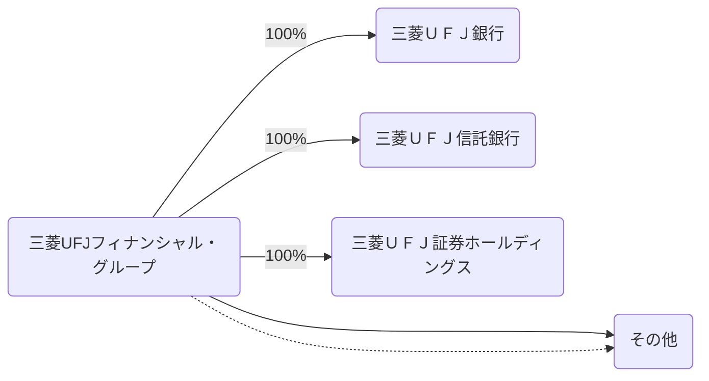
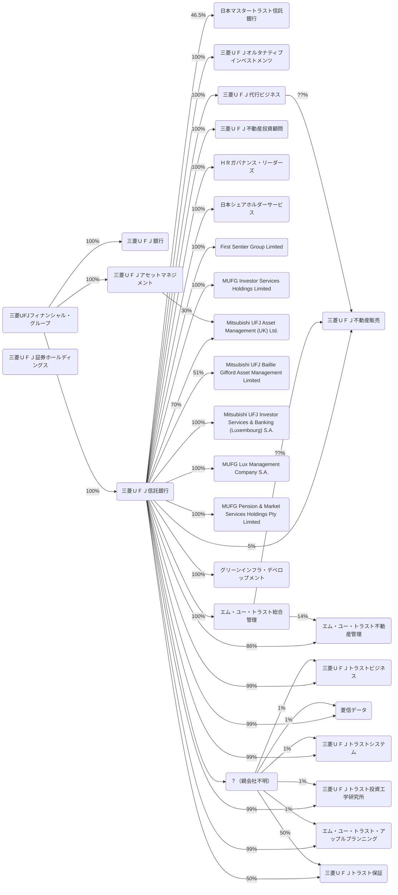
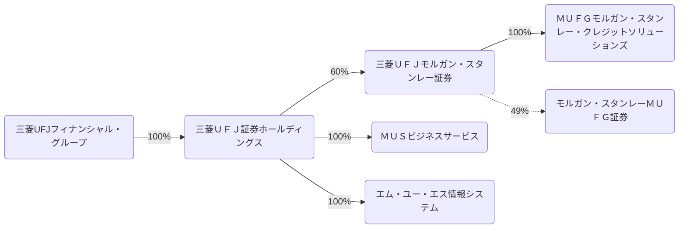
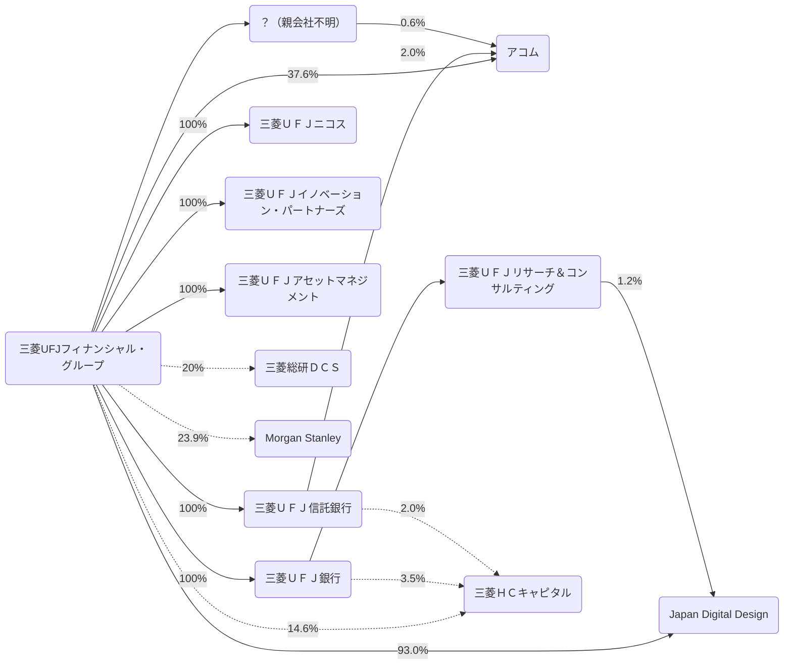

2026/03の有価証券報告書をもとに三菱UFJフィナンシャルグループを見る。

## データの出典
会社のホームページ又はEDINET閲覧（提出）サイト（https://disclosure2.edinet-fsa.go.jp/week0010.aspx）に提出された有価証券報告書より抜粋して作成
- [有価証券報告書](https://www.mufg.jp/ir/report/security_report/2026/index.html)
  - 三菱UFJフィナンシャル・グループ
  - 三菱UFJ銀行
  - 三菱UFJ信託銀行
- [有価証券報告書](https://www.hd.sc.mufg.jp/finance/securities_report.html)

## 事業系統図
- 株式会社は省略
- 実線は子会社、点線は持分法適用関連会社を表す
- その他とまとめられている会社は省く
- 保有率は小数第二位を四捨五入
- 図が大きくなりすぎるので主要な子会社ごとに分ける

### 三菱ＵＦＪ銀行

```mermaid
flowchart LR
  MUFG("三菱UFJフィナンシャル・グループ")
  MUBK("三菱ＵＦＪ銀行")
  MUTB("三菱ＵＦＪ信託銀行")
  MUSHD("三菱ＵＦＪ証券ホールディングス")

  MUFG -->|"100%"| MUBK
  MUFG -->|"100%"| MUTB
  MUFG -->|"100%"| MUSHD

  WN("ウェルスナビ")
  MESMART("三菱ＵＦＪ ｅスマート証券")
  MUDB("ＭＵデジタルバンク設立準備")
  MONEYTR("マネーツリー")
  TKYCRS("東京クレジットサービス")
  click TKYCRS https://www.tokyo-card.co.jp/tcs/outline.html
  KANM("カンム")
  MFACTOR("三菱ＵＦＪファクター")
  MURC("三菱ＵＦＪリサーチ＆コンサルティング")
  click MURC https://www.murc.jp/corporate/about/
  MUFDC("エム・ユー・フロンティア債権回収")
  MUWA("三菱ＵＦＪウェルスアドバイザーズ")
  MGMOS("ＭＵＦＧ ＧＭＯセキュリティ")
  BT("BusinessTech")
  MSTINV("ＭＵＦＧストラテジック・インベストメント")
  MTR("ＭＵＦＧトレーディング")
  ARTV("アルテミスベンチャーズ")
  MSUSE("ＭＵＦＧサステナブルエナジー")
  MUAHD("MUFG Americas Holdings Corporation")
  SCCAN("MUFG Securities (Canada), Ltd.")
  BKMEX("MUFG Bank Mexico, S.A.")
  BKBR("Banco MUFG Brasil S.A.")
  SCEMEA("MUFG Securities EMEA plc")
  BKRUS("AO MUFG Bank (Eurasia)")
  BKNET("MUFG Bank (Europe)N.V.")
  BKTUR("MUFG Bank Turkey Anonim Sirketi")
  BKTHAI("Bank of Ayudhya　Public Company Limited")
  BKCN("MUFG Bank (China),Ltd")
  BKINDN("PT Bank Danamon Indonesia Tbk")
  SCASIA("MUFG Securities Asia Limited")
  BKMAL("MUFG Bank (Malaysia)Berhad")
  MFINDN("PT Adira Dinamika Multi Finance Tbk")
  MPARTTHAI("MUFG Participation (Thailand)Co., Ltd.")
  MARS("Mars Equity M.C. Pte. Ltd")
  JACKS("ジャックス")
  GROOVE("グルーヴノーツ")
  RECMB("リクルートＭＵＦＧビジネス")
  MFLEASE("ＭＵＦＧファイナンス＆リーシング")
  click MFLEASE https://www.fl.mufg.jp/company/profile.html
  SATDS("衛星データサービス企画")
  ECLEAR("eClear")
  MCAP("三菱ＵＦＪキャピタル")
  click MCAP https://www.mucap.co.jp/corporateinfo/overview/
  KOTORA("ことら")
  MABRAINS("三菱アセット・ブレインズ")
  JALC("ジャルカード")
  REMUJIN("日本住宅無尽")
  click REMUJIN https://www.nihon-jm.co.jp/company/gaiyo/index.html
  VN("Vietnam Joint Stock Commercial Bank for Industry and Trade")
  PHI("Security Bank Corporation")
  MARSGROWTH("Mars Growth Capital Pte. Ltd.")
  BGKM("Bangkok MUFG Limited")
  MARSEQ1("Mars Equity 1 GP Pte. Ltd.")
  MUHDTHAI("MUFG Holding (Thailand) Co., Ltd.")
  XXX("？（親会社不明）")
  YYY("？（親会社不明）")

  MUBK -->|"100%"| WN
  MUBK -->|"100%"| MESMART
  MUBK -->|"100%"| MUDB
  MUBK -->|"95%"| MONEYTR
  WN -->|"5%"| MONEYTR
  MUBK -->|"31.5%"| TKYCRS
  YYY -->|"24.2%"| TKYCRS
  MUBK -->|"68.9%"| KANM
  XXX -->|"4.2%"| KANM
  MUBK -->|"100%"| MFACTOR
  MUBK -->|"36.9%"| MURC
  MFACTOR -->|"?%"| MURC
  MCAP -->|"?%"| MURC
  MUBK -->|"96.5%"| MUFDC
  MUBK -->|"47.3%"| MUWA
  MUBK -->|"50.1%"| MGMOS
  MUBK -->|"100%"| BT
  MUBK -->|"100%"| MSTINV
  MUBK -->|"100%"| MTR
  MUBK -->|"100%"| ARTV
  MUBK -->|"100%"| MSUSE
  MUFG -->|"4.7%"| MUAHD
  MUBK -->|"95.3%"| MUAHD
  MUBK -->|"100%"| SCCAN
  MUBK -->|"99.9%"| BKMEX
  MUAHD -->|"0.1%"| BKMEX
  MUBK -->|"99.9%"| BKBR
  MUBK -->|"100%"| SCEMEA
  MUBK -->|"100%"| BKRUS
  MUBK -->|"100%"| BKNET
  MUBK -->|"100%"| BKTUR
  MUBK -->|"76.9%"| BKTHAI
  MUBK -->|"100%"| BKCN
  MUBK -->|"92.5%"| BKINDN
  MUBK -->|"100%"| SCASIA
  MUBK -->|"100%"| BKMAL
  MUBK -->|"18.9%"| MFINDN
  BKINDN -->|"74.5%"| MFINDN
  MUBK -->|"10%"| MPARTTHAI
  MUHDTHAI -->|"2.3%"| MPARTTHAI
  MUBK -->|"100%"| MARS
  MUBK -."40.2%".-> JACKS
  XXX -."0.1%".-> JACKS
  MUBK -."20.5%".-> GROOVE
  MUBK -."49%".-> RECMB
  MUBK -."33.5%".-> MFLEASE
  TKYCRS -."3.8%".-> MFLEASE
  XXX -."1.6%".-> MFLEASE
  MUBK -."29.1%".-> SATDS
  MUBK -."49.0%".-> ECLEAR
  MUBK -."22.6%".-> MCAP
  MFACTOR -."5.3%".-> MCAP
  MUTB -."?%".-> MCAP
  MUSHD -."?%".-> MCAP
  MUBK -."25%".-> KOTORA
  MUBK -."25%".-> MABRAINS
  MUBK -."0.0%".-> JALC
  MUBK -."5.0%".-> REMUJIN
  XXX -."43.9%".-> REMUJIN
  MUBK -."19.7%".-> VN
  MUBK -."20.0%".-> PHI
  MUBK -."50%".-> MARSGROWTH
  MUBK -."10%".-> BGKM
  MUHDTHAI -."10%".-> BGKM
  MUBK -."38.8%".-> MARSEQ1

  MUBK -."10.0%".-> MUHDTHAI
  BKTHAI -."10.0%".-> MUHDTHAI
  MUFG --> XXX
  MUBK --> YYY
```

### 三菱ＵＦＪ信託銀行

### 三菱ＵＦＪ証券ホールディングス

### その他

## 連結貸借対照表
### 資産(2026/03/31)
<canvas data-json="/finance/assets/data/mufg_202603.json" data-date="2026-03-31" data-chart-type="bar" data-name="Balance Sheet" data-side="asset" > </canvas>

### 資産(2025/03/31)
<canvas data-json="/finance/assets/data/mufg_202603.json" data-date="2025-03-31" data-chart-type="bar" data-name="Balance Sheet" data-side="asset" > </canvas>

### 負債・純資産(2026/03/31)
<canvas data-json="/finance/assets/data/mufg_202603.json" data-date="2026-03-31" data-chart-type="bar" data-name="Balance Sheet" data-side="liability"> </canvas>

### 負債・純資産(2025/03/31)
<canvas data-json="/finance/assets/data/mufg_202603.json" data-date="2025-03-31" data-chart-type="bar" data-name="Balance Sheet" data-side="liability"> </canvas>

## 連結損益計算書及び連結包括利益計算書
### 2026/03/31
<canvas data-json="/finance/assets/data/mufg_202603.json" data-date="2026-03-31" data-chart-type="waterfall" data-name="Profit and Loss"> </canvas>

### 2025/03/31
<canvas data-json="/finance/assets/data/mufg_202603.json" data-date="2025-03-31" data-chart-type="waterfall" data-name="Profit and Loss"> </canvas>

## 連結キャッシュ・フロー計算書
### 2026/03/31
<canvas data-json="/finance/assets/data/mufg_202603.json" data-date="2026-03-31" data-chart-type="waterfall" data-name="Cashflow"> </canvas>

### 2025/03/31
<canvas data-json="/finance/assets/data/mufg_202603.json" data-date="2025-03-31" data-chart-type="waterfall" data-name="Cashflow"> </canvas>
