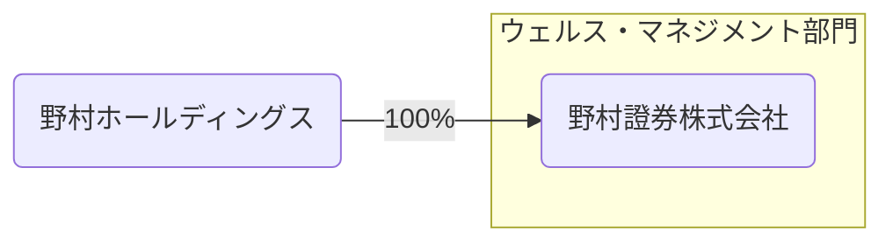
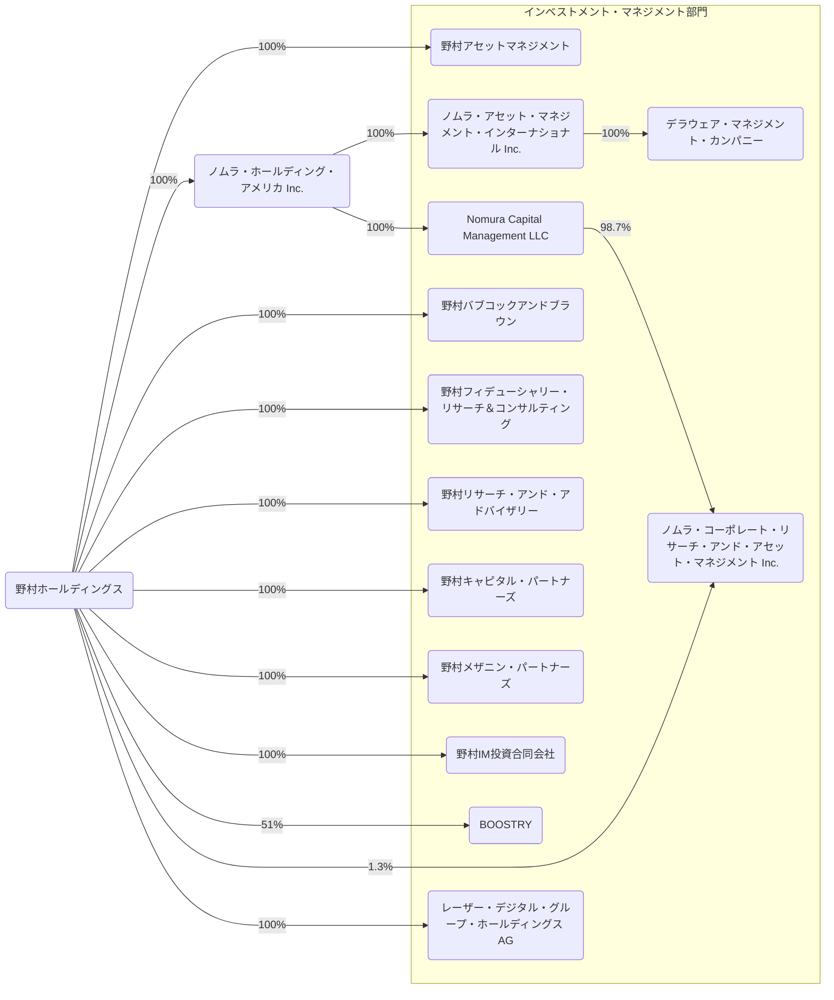
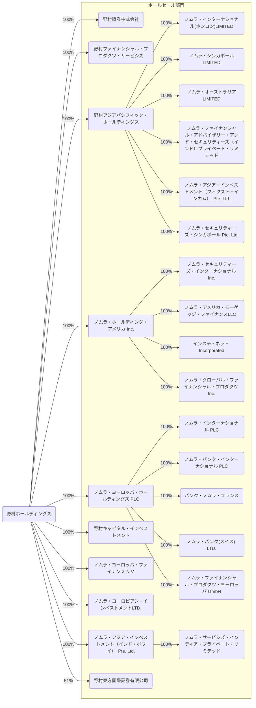
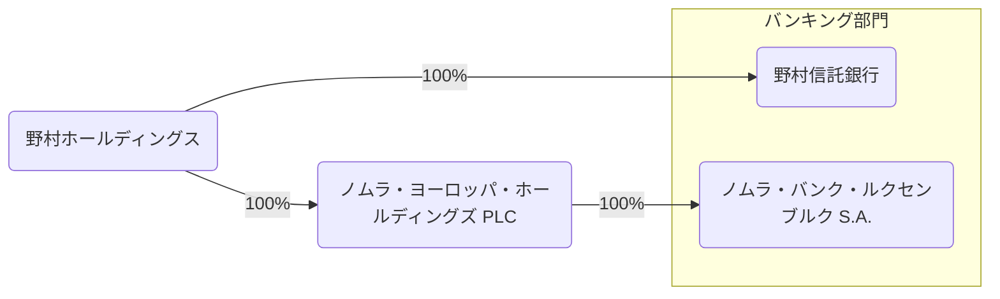
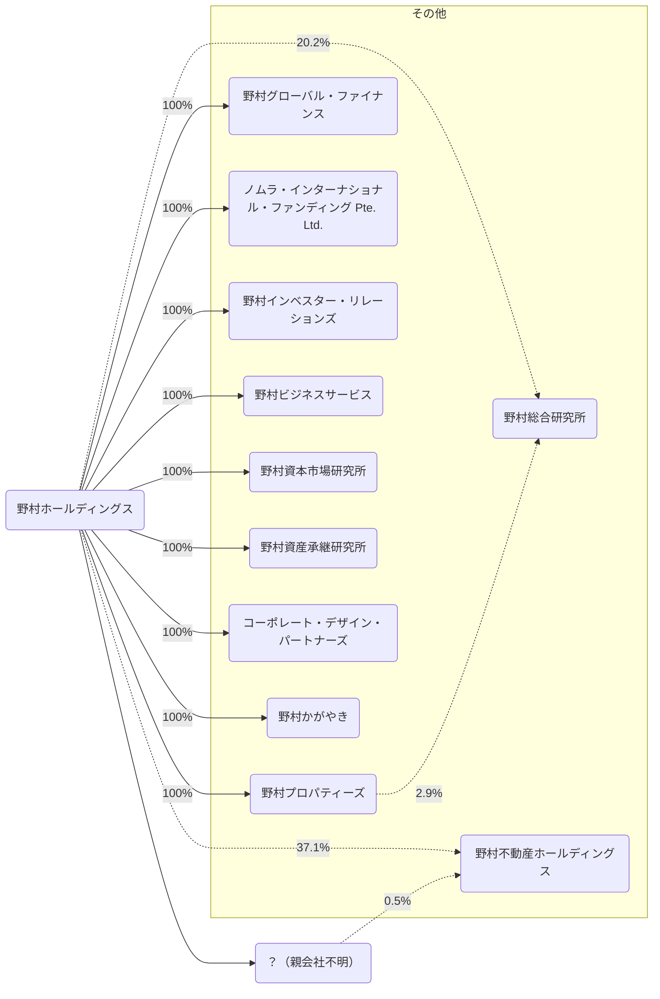

2026/03の有価証券報告書をもとに野村ホールディングスを見る。

## データの出典
会社のホームページ又はEDINET閲覧（提出）サイト（https://disclosure2.edinet-fsa.go.jp/week0010.aspx）に提出された有価証券報告書より抜粋して作成
- [有価証券報告書](https://www.nomuraholdings.com/jp/investor/library/report.html#report_01)

## 事業部門
> 野村の事業別セグメントの構成は、主要な商品・サービスの性格および顧客基盤ならびに経営管理上の組織

### ウェルス・マネジメント部門
> 主に日本国内の個人投資家等に対し資産管理型営業によるサービスを提供しております。

### インベストメント・マネジメント部門
> 主に投資信託の設定や運用、国内外の投資家に対する投資一任サービス、投資法人や機関投資家向けファンドの運用や管理、匿名組合管理など、さまざまな投資運用サービスや投資ソリューションを提供しております。

### ホールセール部門
> 全世界的な規模で債券、株式、デリバティブや為替のセールスおよびトレーディング業務を行うとともに、債券および株式の引受および売出し業務、M&Aの仲介、財務アドバイザリー業務などの多様な投資銀行サービスを提供しております。

### バンキング部門
> 傘下のエンティティである野村信託銀行株式会社とNomura Bank (Luxembourg) S.A.のそれぞれの強みである「プライベート」「オーダーメイド」といった特長を活かし、お客様の資産形成や円滑な資産承継等のさまざまなニーズに応えてまいります。野村は、2025年12月１日にマッコーリー・グループの資産運用会社の取得を完了しました。取得した事業の業績は、2025年12月１日以降、インベストメント・マネジメント部門に計上されております。

## 2025年度の取り組み
### ウェルス・マネジメント部門
> 当期は好調なマーケット環境を背景に、顧客ニーズを的確に捉え、対面チャネルを中心に株式および投資信託の買付が増加し、フロー収入等は増加しました。加えて、継続的に取り組んできたお客様の資産全体に対する資産管理サービスにより、預り資産の拡大にともないストック収入も増加しました。また、ワークプレイス（職域）サービスによる接点拡大を通じて、持続的な顧客基盤の構築、部門の中長期的なサービス拡大を目指しておりますが、現役世代のお客様を含め、ワークプレイスサービスを提供するお客様を順調に拡大することができております。今後も、サービスを必要とする多くのお客様に、対面によるコンサルティングや、デジタルツール等を用いた非対面サービス、資産形成ニーズへの対応を含むワークプレイスサービスなど、幅広い形でウェルス・マネジメントサービスを提供してまいります。

### インベストメント・マネジメント部門
> 当期は、期初および期末に調整局面が見られたものの、株式市場が前期を上回る水準で推移したことに加え、2025年12月に買収を完了したMacquarie Group Limitedの米国および欧州におけるパブリック・アセットマネジメント事業の取得にともなう運用資産残高の加算もあり、当期末の運用資産残高は136.9兆円となり、過去最高となりました。また、期中平均の運用資産残高も前期比で増加し、事業収益の拡大に寄与しました。買収した事業において資金流出が生じたものの、当期の資金純流入は0.4兆円となり、全体でも純流入を確保しました。こうした運用資産残高の拡大を背景に、アセットマネジメント・ビジネスの増収に加え、航空機リースビジネスにおいて優良案件を獲得し、販売量も伸びたことが収益拡大に寄与し、安定収益である事業収益は過去最高となりました。さらに、オルタナティブ運用資産残高は、堅調な資金流入と運用益により、当期末は3.6兆円となり、前期末比で増加しました。加えて、投資家の投資スタイルに応じてバランスよく投資できる「のむラップ・ファンド」シリーズは安定した資金流入が続き、純資産総額が1.5兆円を突破しました。

### ホールセール部門
> グローバル・マーケッツは、リスク管理を徹底しながら、マクロ環境、金融政策および地政学的緊張などに絡むマーケットの不透明感を背景とした投資家のポートフォリオのリバランス取引やヘッジ取引などに対して流動性を提供しました。また、顧客アクティビティやマーケットの機会を適切に捉え、特にエクイティ・プロダクト、証券化商品およびインターナショナル・ウェルス・マネジメント（海外富裕層ビジネス）を中心に収益を積み上げました。インベストメント・バンキングは、地域ごとに違いはあったものの、グローバルに顧客活動が増え、ニーズが多様化する中で、サービスやソリューションの提案に尽力した結果、案件が増加しました。特に、日本ではアドバイザリーとエクイティ・ソリューション、海外地域ではアドバイザリーに加えてエクイティ・ソリューションや一部レンディングを含むソリューションが堅調だったことが増収につながりました。

### バンキング部門
> 部門間連携を強化してきていることに加え、営業活動や広告宣伝の効果等も出てきており、KPIとして掲げる、野村信託銀行株式会社のローン残高と投資信託受託残高、Nomura Bank (Luxembourg) S.A.の管理資産残高が、期を通じて着実に伸長いたしました。その結果、安定収益として位置づけられるバンキング部門の収益は、前期から増収となりました。一方、野村信託銀行株式会社の勘定系システムの更改等を実施していることから費用が増加しているものの、今後の商品・サービスの提供を充実させるための基盤の構築が進捗しております。

## 事業系統図
- 株式会社は省略
- 実線は子会社、点線は持分法適用関連会社を表す
- その他とまとめられている会社は省く
- 保有率は小数第二位を四捨五入
- 図が大きくなりすぎるので事業部門ごとに分ける

### ウェルス・マネジメント部門

### インベストメント・マネジメント部門

### ホールセール部門
- ノムラ・アメリカ・モーゲッジ・ファイナンスLLCの親会社は推測
- ノムラ・インターナショナル(ホンコン)LIMITEDの親会社は推測

### バンキング部門

### その他部門

## 連結貸借対照表
連結はUS-GAAP
### 資産(2026/03/31)
<canvas data-json="/finance/assets/data/nomura_hd_202603.json" data-date="2026-03-31" data-chart-type="bar" data-name="Balance Sheet" data-side="asset" > </canvas>

### 資産(2025/03/31)
<canvas data-json="/finance/assets/data/nomura_hd_202603.json" data-date="2025-03-31" data-chart-type="bar" data-name="Balance Sheet" data-side="asset" > </canvas>

### 負債・純資産(2026/03/31)
<canvas data-json="/finance/assets/data/nomura_hd_202603.json" data-date="2026-03-31" data-chart-type="bar" data-name="Balance Sheet" data-side="liability"> </canvas>

### 負債・純資産(2025/03/31)
<canvas data-json="/finance/assets/data/nomura_hd_202603.json" data-date="2025-03-31" data-chart-type="bar" data-name="Balance Sheet" data-side="liability"> </canvas>

## 連結損益計算書及び連結包括利益計算書
連結はUS-GAAP
### 2026/03/31
<canvas data-json="/finance/assets/data/nomura_hd_202603.json" data-date="2026-03-31" data-chart-type="waterfall" data-name="Profit and Loss"> </canvas>

### 2025/03/31
<canvas data-json="/finance/assets/data/nomura_hd_202603.json" data-date="2025-03-31" data-chart-type="waterfall" data-name="Profit and Loss"> </canvas>

## 連結キャッシュ・フロー計算書
連結はUS-GAAP
### 2026/03/31
<canvas data-json="/finance/assets/data/nomura_hd_202603.json" data-date="2026-03-31" data-chart-type="waterfall" data-name="Cashflow"> </canvas>

### 2025/03/31
<canvas data-json="/finance/assets/data/nomura_hd_202603.json" data-date="2025-03-31" data-chart-type="waterfall" data-name="Cashflow"> </canvas>