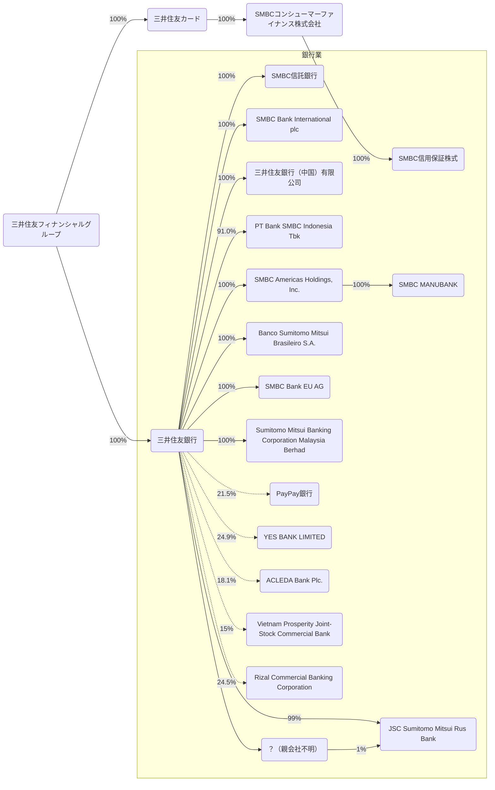
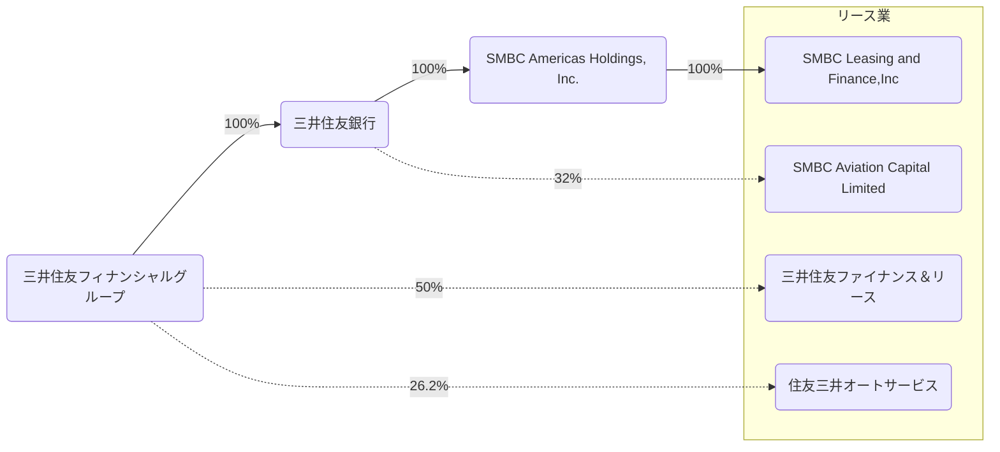
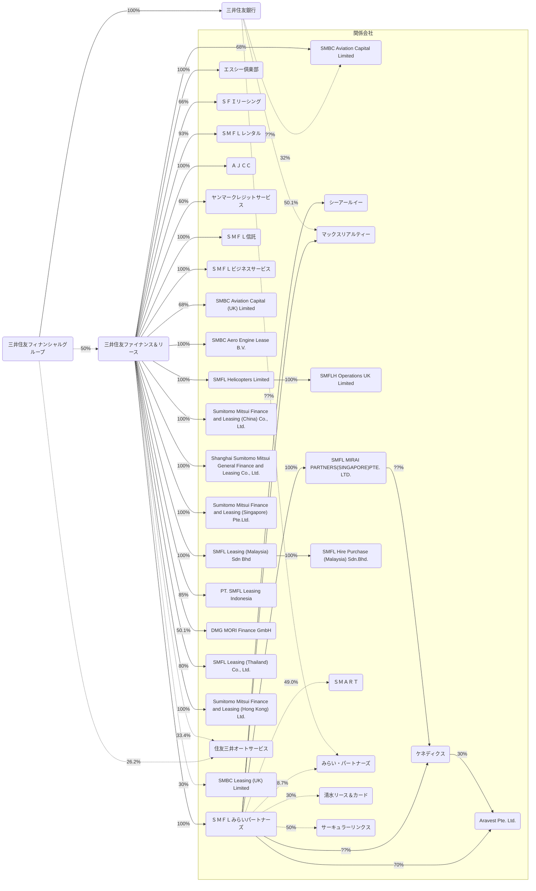
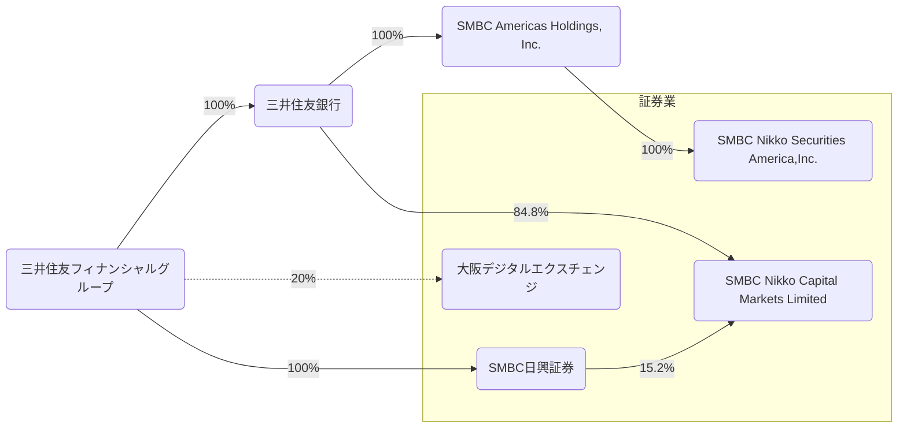
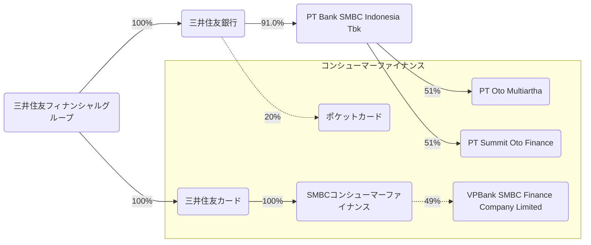
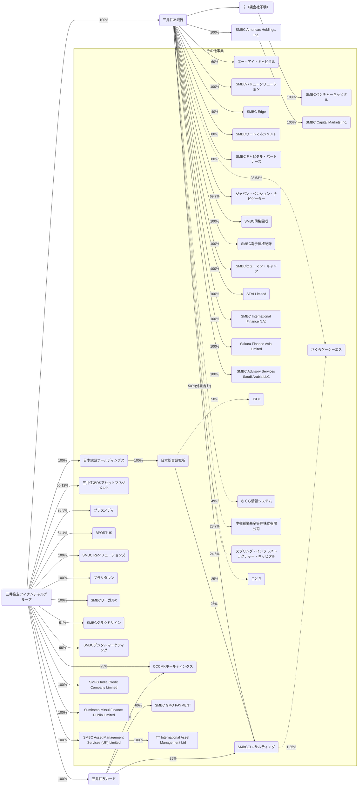

2026/03の有価証券報告書をもとに三井住友フィナンシャルグループを見る。

## データの出典
会社のホームページ又はEDINET閲覧（提出）サイト（https://disclosure2.edinet-fsa.go.jp/week0010.aspx）に提出された有価証券報告書より抜粋して作成
- [有価証券報告書](https://www.smfg.co.jp/investor/financial/yuho.html)
  - 三井住友フィナンシャルグループ
  - 三井住友銀行

## 事業部門制
> 事業部門制は、お客さまの様々なニーズへの対応力をグループベースで一層強化するため、お客さまセグメント毎に事業戦略を立案・実行する枠組みとして導入したもので、リテール事業部門、ホールセール事業部門、グローバル事業部門及び市場事業部門の４つの事業部門

### ホールセール事業部門
> 国内の大企業及び中堅・中小企業のお客さまに対応した業務

### リテール事業部門
> 国内の個人を中心としたお客さまに対応した業務

### グローバル事業部門
> 海外の日系・非日系企業等のお客さまに対応した業務

### 市場事業部門
> 金融マーケットに対応した業務

### 本社管理
> 上記各事業部門に属さない業務等

## 2025年度の取り組み
### ホールセール事業部門
> 活況なコーポレートアクション等を背景に、お客さまの資金調達、資本政策等に関するニーズが高まる中、リスクテイクの強化や銀証をはじめとするSMBCグループ各社の連携を通じて、付加価値の高いソリューションを提供しました。

### リテール事業部門
> 「Olive」を軸に、顧客基盤及び業容の大幅な拡大を実現させることができました。ビジネス別には、資産運用ビジネスにおいては投資信託や外貨預金等を中心に運用資産を積み上げ、更に株高等の良好な市場環境の追い風もあり残高を拡大しました。決済・コンシューマーファイナンスビジネスにおいても、順調な会員獲得に加えキャッシュレス市場拡大を着実に捉え、買物取扱高及びファイナンス残高を伸長させました。

### グローバル事業部門
> 事業ポートフォリオの収益性向上に向けた資源シフト加速、Jefferies Financial Group Inc.との連携の強化をはじめとしたCIBの高度化、アジアマルチフランチャイズ戦略におけるインドのYES BANKへの出資等、成長に向けた取り組みを着実に進めました。

> 上記取り組みの結果、低採算アセットに係る売却損を計上しつつも、ROE重視の運営強化を通じた利鞘改善や、FX・デリバティブ・DCMなどの付帯取引拡充に加え、SMBC Aviation Capital limitedの好業績も寄与し、連結業務純益は前連結会計年度比163億円増益の6,558億円となりました。

### 市場事業部門
> 昨年４月の米国政府による関税措置の公表を受けた相場変動の影響など、ボラタイルな相場環境が継続する中、株式や債券のポートフォリオ運営において適切にリスク量をコントロールしつつ投資機会を着実に捉え、収益を確保しました。

## 事業系統図
- 株式会社は省略
- 実線は子会社、点線は持分法適用関連会社を表す
- その他とまとめられている会社は省く
- 保有率は小数第二位を四捨五入
- 図が大きくなりすぎるので事業ごとに分ける

### 銀行業

### リース業

三井住友ファイナンス＆リースの事業系統図は次の通り。

### 証券業

### コンシューマーファイナンス業

### その他事業
- TT International Asset Management Ltdの親会社は推測

## 連結貸借対照表
### 資産(2026/03/31)
<canvas data-json="/finance/assets/data/smfg_202603.json" data-date="2026-03-31" data-chart-type="bar" data-name="Balance Sheet" data-side="asset" > </canvas>

### 資産(2025/03/31)
<canvas data-json="/finance/assets/data/smfg_202603.json" data-date="2025-03-31" data-chart-type="bar" data-name="Balance Sheet" data-side="asset" > </canvas>

### 負債・純資産(2026/03/31)
<canvas data-json="/finance/assets/data/smfg_202603.json" data-date="2026-03-31" data-chart-type="bar" data-name="Balance Sheet" data-side="liability"> </canvas>

### 負債・純資産(2025/03/31)
<canvas data-json="/finance/assets/data/smfg_202603.json" data-date="2025-03-31" data-chart-type="bar" data-name="Balance Sheet" data-side="liability"> </canvas>

## 連結損益計算書及び連結包括利益計算書
### 2026/03/31
<canvas data-json="/finance/assets/data/smfg_202603.json" data-date="2026-03-31" data-chart-type="waterfall" data-name="Profit and Loss"> </canvas>

### 2025/03/31
<canvas data-json="/finance/assets/data/smfg_202603.json" data-date="2025-03-31" data-chart-type="waterfall" data-name="Profit and Loss"> </canvas>

## 連結キャッシュ・フロー計算書
### 2026/03/31
<canvas data-json="/finance/assets/data/smfg_202603.json" data-date="2026-03-31" data-chart-type="waterfall" data-name="Cashflow"> </canvas>

### 2025/03/31
<canvas data-json="/finance/assets/data/smfg_202603.json" data-date="2025-03-31" data-chart-type="waterfall" data-name="Cashflow"> </canvas>
