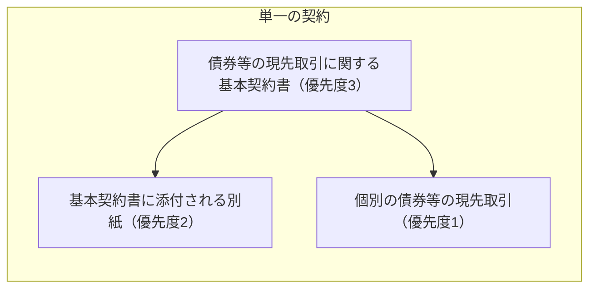
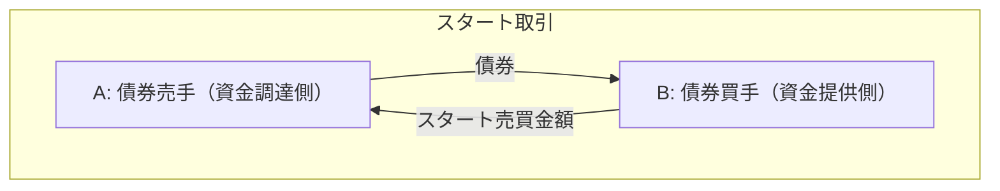
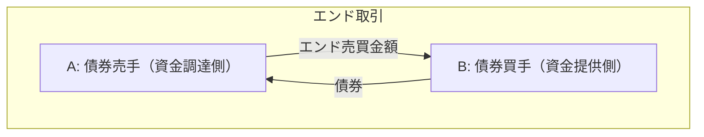

日証協の基本契約書のひな型をもとに、日本の現先取引についてみる。

## 契約の構造

> 第 １ 条（適 用） 
>１ 甲と乙との間で行われる個別の債券等の現先取引（以下「個別現先取引」という。）に係る契約は、本基本契約書に基づいて締結される。 
>２ 本基本契約書に添付される別紙（以下、それぞれを「各別紙」と、すべての別紙を総称して「別紙」という。）は本基本契約書の一部を構成するものとし、本基本契約書及び個別現先取引に係る契約は一体となってすべての個別現先取引に関する単一の契約を構成するものとする。本基本契約書のうち本文（本基本契約書の別紙以外の部分をいう。以下同じ。）と各別紙との間に抵触する規定がある場合には各別紙の規定が本文の規定に優先し、本基本契約書と個別現先取引に係る契約との間に抵触する規定がある場合には、当該個別現先取引に係る契約の規定が本基本契約書の規定に優先するものとする。 

## 取引にかかわる言葉の定義

|言葉|意味|
|---|---|
|売手|個別現先取引におけるスタート取引において、買手に対し取引対象債券等を売り付ける者をいう|
|エンド取引|個別現先取引において買手が売手に対し同種、同量の債券等を売り戻す取引をいう|
|エンド取引受渡日|エンド取引の受渡日として、個別現先取引で定める日をいう。ただし、別途定めがある場合、当該定めに基づき、買手が同種、同量の債券等を売り戻し、売手が同種、同量の債券等を買い戻す日をいう|
|エンド売買金額|エンド取引の受渡金額として、個別現先取引につき各別紙に定める計算方法に従い算出される金額をいう|
|買手|個別現先取引におけるスタート取引において、売手から取引対象債券等を買い付ける者をいう|
|現先レート|エンド売買金額算定の基準となる料率として、個別現先取引で定めるものをいう|
|スタート取引|個別現先取引において売手が買手に対し取引対象債券等を売り付ける取引をいう|
|スタート取引受渡日|スタート取引の受渡日として、個別現先取引で定める日をいう|
|スタート売買金額|スタート取引の受渡金額として、個別現先取引につき各別紙に定める計算方法に従い算出される金額をいう|
|売買金額|債券等についての売買単価に数量を乗じた価額をいう|
|売買単価|債券等についての経過利子を含む額面100％当たりの価額割合をいう|

## 取引

> 第 ３ 条（取引の成立、確認及び終了） 
> １ 個別現先取引は、口頭、書面又はその他の方法（電子的方法によるものを含むがこれらに限られない。）による一方当事者の申込と他方当事者による承諾の合致により成立する。 
> ２ 前項により個別現先取引が成立した場合、当事者は、各別紙の定めに従い、当該個別現先取引に係る個別取引明細書を交付し、又はかかる個別取引明細書の交付に代えて当該個別現先取引に係る契約内容を確認するものとする。 
> ３ スタート取引受渡日に、売手は、買手によるスタート売買金額の支払と引き換えに、買手に対し取引対象債券等を引き渡すものとする。 
> ４ エンド取引受渡日に、買手は、売手によるエンド売買金額の支払と引き換えに、売手に対し同種、同量の債券等を引き渡すことにより、当該個別現先取引は終了するものとする。 

1. 取引が成立
2. 書面で契約内容の確認（コンファメーション）
3. スタート取引

4. エンド取引。エンド取引をもって取引が終了

## 権利の移転
> 第 ５ 条（権利の移転時期） 
> 個別現先取引における当該取引対象債券等上の権利は、スタート取引受渡日において買手が売手にスタート売買金額の全額を支払ったときに売手から買手に移転し、エンド取引受渡日において売手が買手にエンド売買金額の全額を支払ったときに買手から売手に移転するものとする。

金銭が支払われたら債券の権利が移転する。

## 担保
> 第 ７ 条（担保の管理等） 
> １ 他方当事者に対して純与信額を有する当事者は、いつでも、当該他方当事者に対し、通知により、純与信額が零以上となるよう担保の差入れ又は返戻を請求することができる。 
> ２ 前項に基づく担保の差入れは消費貸借の形式によるものとする。 

現先取引は、「純与信額がゼロ以上」となるように、消費貸借の形式で担保の請求ができる。

|言葉|意味|
|---|---|
|個別取引与信額|スタート取引受渡日からエンド取引受渡日（ただし、同種、同量の債券等が売手に受け渡された日又は取引が終了した日がエンド取引受渡日より後である場合にはそれらの日とする。）までの間の任意の時点における当該個別現先取引についての次の①と②の差額をいう ① 当該時点をエンド取引受渡日とみなした場合におけるエンド売買金額に、売買金額算出比率に１を加えた数値を乗じた額 ② 当該時点における同種、同量の債券等の時価総額 ①の額が②の額より大きい場合、買手がその差額に等しい額の個別取引与信額を有し、②の額が①の額より大きい場合、売手がその差額に等しい額の個別取引与信額を有する|
|純与信額|一方当事者の個別取引与信額の合計額から当該一方当事者に差し入れられた担保の額（担保金の場合、未払いの担保金利息を含む。担保証券の場合、その時価総額に担保掛目を乗じた額とする。本号において以下同じ。を減じた額が、他方当事者の個別取引与信額の合計額から当該他方当事者に差し入れられた担保の額を減じた額を超過している場合、その超過額をいう|
|売買金額算出比率|個別現先取引において、取引成立時点における取引対象債券等の時価をスタート売買単価で除し、これにより算出された比率から１を減じた比率であって、各別紙において定めるものをいう|

純与信額とは個別取引与信額の和から担保を差し引いた値である。
証券の買手からみた売手への個別取引与信額は次のように計算される。

$$
\begin{aligned}
① &= V_{end} \times (1+h) \\
② &= MV_{bond}(t) \times N_{bond} \\
Exposure(t) &= ① - ② \\ 
&= V_{end} \times (1+h) - MV_{bond}(t) \times N_{bond}
\end{aligned}
$$

売買金額算出比率はその定義から

$$
\begin{aligned}
h=\frac{MV_{bond}(0)}{P_{start}} - 1 \\
P_{start} = \frac{MV_{bond}(0)}{1+h}
\end{aligned}
$$

と表される。
式からもわかる通り、売買金額算出比率は取引開始時に定めた、債券の時価を現金相当額に換算するために、債券の時価を割ることで減じる値である。
すなわち、除算型のヘアカットである。

個別与信額の①の部分は将来買手に戻ってくる現金の債券の時価相当額であり、②の部分は時点$t$で買手の手元にある債券の時価総額である。
したがって$Exposure(t) \geq 0$は債券の買手に未実現利益がある状態である。
この未実現利益を補填するために、証券の買手は売手に対して担保を請求できる。
簡単のため1取引しかないとすると、個別取引与信額から受け取った担保の額を減じることにより、純与信額は

$$
Credit(t) = Exposure(t) - Collateral(t) = V_{end} \times (1+h) - MV_{bond}(t) \times N_{bond} - Collateral(t)
$$

と計算される。
「純与信額が零以上となるよう担保の差入れ又は返戻を請求することができる」とは

$$
\begin{aligned}
Credit(t) & \geq 0 \\ 
Exposure(t) - Collateral(t) & \geq 0 \\
Exposure(t) & \geq Collateral(t)
\end{aligned}
$$

より、証券の買手が売手に差入れの請求できる担保の額は与信額以下までということである。
証券の買手が受け取っている担保の額が変動し与信額を超えたら、純与信額が0以下になるので、売手は純与信額が0以上になるように担保の返戻を請求することができる。

|記号|意味|
|---|---|
|$V_{end}$|エンド売買金額。取引で決まるため固定|
|$h$|売買金額算出比率。0以上。取引で決まるため固定|
|$MV_{bond}(t)$|時点$t$における債券の時価|
|$N_{bond}$|債券の枚数。取引で決まるため固定|
|$Exposure(t)$|時点$t$における、証券の買手から見た売手への与信額|
|$P_{start}$|スタート取引における債券の単価。経過利子を含む。取引で決まるため固定|
|$Collateral(t)$|証券の買手が売手から受け取った担保の額|
|$Credit(t)$|純与信額|

> ５ 担保の差入れの請求を受けた当事者は、担保金又は担保証券のいずれかを選択して差入れを行うものとする。また、担保の差入れの請求を受けた当事者は、担保証券による場合、予め合意された担保証券のうちいずれの担保証券により差入れを行うかを選択することができる。 

担保は担保金または担保証券のいずれか。

|言葉|意味|
|---|---|
|担保金|各別紙に定める方法に従って買手又は売手に差し入れられる金銭をいう|
|担保証券|担保の移転に関し、担保金に代わるものとして各別紙において定めた有価証券をいう|

> ８ 担保金には、各別紙で定められた利率による利息を付すことができ、当該利息の支払は当該別紙で定められた支払時期の規定に従って行われるものとする。 

担保が担保金の場合は利息を付すことができる。
この利息の利率が担保金利率（リベート）である。

## 担保と信用リスク
与信額で気を付ける必要があるのが、
1. キャッシュや債券のフローの現在価値を計算しているわけではないということ
2. 担保の時価を時価をそのまま使用しており、担保の過不足を見るもの。現金がどれだけ損失しうるかといった現金に主眼を置いた値ではないということ

である。
現先はデリバティブと異なり、取引期間が短いため現在価値への割引の影響はそこまで多くないだろう。
現金に主眼を置いた値を計算するには、エンド売買金額から売買金額算出比率の項を外し、債券時価をその項で除せばよい（ヘアカットを適用すればよい）。
すなわち、

$$
\begin{aligned}
CashExposure(t) &= \frac{Exposure(t)}{1+h} \\
&= V_{end} - \frac{MV_{bond}(t)}{1+h} \times N_{bond} \\
\end{aligned}
$$

|記号|意味|
|---|---|
|$CashExposure(t)$|時点$t$における、現金に主眼を置いた、証券の買手から見た売手への与信額|

担保がすべて担保金だとみなすと、現金に主眼を置いた純与信額は

$$
\begin{aligned}
CashCredit(t) &= CashExposure(t)- CashCollateral(t) \\
&= V_{end} - \frac{MV_{bond}(t)}{1+h} \times N_{bond} - CashCollateral(t) \\
\end{aligned}
$$

|記号|意味|
|---|---|
|$CashCollateral(t)$|時点$t$における証券の買手が売手から受け取った担保金|
|$CashCredit(t)$|時点$t$における、現金に主眼を置いた、証券の買手から見た売手への純与信額|

## 担保のサブスティテューション
> 11 一方当事者（以下、本項及び次項において「請求者」という。）が他方当事者に対して担保証券を差し入れている場合、請求者は、同種、同量の担保証券が返戻される前であればいつでも、当該他方当事者に対する通知により、新たな担保証券（当該有価証券が、当該通知日において、当該同種、同量の担保証券が有する時価総額以上の時価総額を有するものであることを要する。）を、当該通知日から３営業日（通知日を含む。）以内の間で各別紙において定める差替日において、当該他方当事者に差し入れることと交換に、当該同種、同量の担保証券を返戻すべきことを申し出ることができる。当該他方当事者が当該申出を承諾した場合、新たな担保証券の差入れと当該同種、同量の担保証券の返戻は同時に行われるものとする。 

既に差し入れている担保証券を新しい担保証券に差し替えることができる。

## 取引のリプライシング
> 13 両当事者は、第１項から前項まで及び各別紙の規定による担保の移転によらず、次の各号に定めるところにより行われる再評価取引により、発生する純与信額を解消することを合意することができる。 
> ⑴ 個別現先取引（本項において「本来の取引」という。）におけるエンド取引受渡日が、再評価する日（以下「再評価日」という。）において到来するものとみなす。 
> ⑵ 両当事者が、次二号に規定された条件で、新たな個別現先取引（以下「再評価取引」という。）を行うものとみなす。 
> ⑶ 再評価取引における取引対象債券等は本来の取引の取引対象債券等と同種、同量の債券等とする。 
> ⑷ 再評価取引におけるスタート取引受渡日は再評価日とする。 
> ⑸ 再評価取引におけるスタート売買金額は、再評価日における同種、同量の債券等の時価総額を本来の取引に適用される売買金額算出比率に１を加えた値で除した額とする。 
> ⑹ 再評価取引に係る諸条件（エンド取引受渡日、現先レート、売買金額算出比率及び前各号に規定されたものを除く他の条件をいう。）は、本来の取引に係る条件と同一とする。 
> ⑺ 再評価取引における両当事者の取引対象債券等の引渡債務及びスタート売買金額の支払債務は、本来の取引における同種、同量の債券等の引渡債務及びエンド売買金額の支払債務との間で相殺されるものとし、相殺後の額の金銭のみが一方当事者から他方当事者へ支払われるものとする。当該金銭は再評価取引締結時に定める期限までに支払われるものとする。 

元の取引のエンド取引受渡日を再評価日として取引を終了させ、その他条件は元の取引のまま再評価日をスタート取引受渡日として新しい取引を開始することができる。
再評価日において未実現利益と担保が相殺されて、相殺後の額が決済されるので純与信額を解消することができる。
デリバティブでいうSTM(Settled-to-Market)である。

## 期中の債券からの収益

> 第 ８ 条（有価証券からの収益金） 
> １ 取引期間中に取引対象債券等の収益金基準日が含まれる場合には、買手は、売手に対し当該取引対象債券等の収益金又はこれと同額の金銭を支払うものとする。ただし、収益金基準日がエンド取引受渡日であり、かつ当該エンド取引受渡日に買手が売手に対し同種、同量の債券等を引き渡した場合を除く。 
> ２ 担保証券が一方当事者（本項において「第一当事者」という。）から他方当事者（本項において「第二当事者」という。）へ差し入れられ、同種、同量の担保証券が第二当事者から第一当事者へ返戻される前に当該担保証券の収益金基準日が到来した場合、第二当事者は、第一当事者に対し当該担保証券に発生した当該収益金又はこれと同額の金銭を支払うものとする。 
> ３ 前二項に基づく支払は、当事者間に別段の合意がある場合を除き、収益金支払日に行うものとする。 
> ４ 取引期間中に取引対象債券等の発行体がその収益金の支払遅延又は支払不能に陥った場合には、次の各号に従うものとする｡
> ⑴ 当該取引期間中に収益金支払が再開されたとき 当該収益金の支払が再開された日以降、買手は速やかに収益金相当額を売手に対して支払うものとする｡
> ⑵ 当該取引期間中に収益金支払が再開されなかったとき 買手は、売手に対して当該収益金請求権の付されている取引対象債券等を売り戻すものとする｡ 

現先取引で売買している債券の利払いがあった場合には、債券の買手から債券の売手に利金の相当額が支払われる。
担保として差し入れられている債券の利払いがあった場合には、担保として債券を受けている側が担保を差し出している側に利金の相当額が支払われる。
一般に、この利金の相当額の支払いはマニュファクチャードペイメント(manufactured payment)と呼ばれる。

## 売買している債券のサブスティテューション

> 第 10 条（取引対象債券等の差替え） １ 個別現先取引（ただし、エンド取引受渡日がスタート取引受渡日の翌営業日である個別現先取引及び売手が既に別段の合意により取引対象債券等を差し替える権利を有している個別現先取引を除く。）につき、取引期間中のいずれの営業日において、売手は、買手に対して通知（当該通知は当該営業日の正午（午前12時）（日本時間。以下同じ。）までに買手に到達することを要する。）により申し出ることにより、当該通知日から３営業日（通知日を含む。）以内の間で別紙において定める差替日に、①売手から買手に対し、取引対象債券等とは異なる合意された額及び銘柄の債券等（以下「新取引対象債券等」という。当該新取引対象債券等は、当該通知日において、売手に対して引き渡される同種、同量の債券等が有する時価総額以上の時価総額を有するものであることとする。）を引き渡し、②買手から売手に対し、同種、同量の債券等を引き渡すことによって、当該取引対象債券等の差替えをすることができる。 
> ２ 前項に定める取引対象債券等の差替えは、買手が、通知が到達した当該営業日の営業終了時までに（売手からの通知が正午より後に到達した場合は当該営業日の翌営業日の営業終了時までに）、売手に対し、当該申出を承諾する旨の意思表示をした場合に限り行うものとする。 
> ３ 第１項に基づく取引対象債券等の差替えにおいては、当事者間に別段の合意がある場合を除き、買手による同種、同量の債券等の引渡しは売手による取引対象債券等の差替えの実行日をエンド取引受渡日とした場合のエンド売買金額（以下本項において「差替売買金額」という。）の支払と引き換えに行われ、売手による新取引対象債券等の引渡しは買手による差替売買金額の支払と引き換えに行われるものとする。かかる場合、買手による同種、同量の債券等の引渡しと売手による差替売買金額の支払は個別現先取引におけるエンド取引の決済とみなし、売手による新取引対象債券等の引渡しと買手による差替売買金額の支払は新たな個別現先取引におけるスタート取引の決済とみなし、本基本契約書の規定を適用する。 
> ４ 第１項に基づく取引対象債券等の差替えが行われた個別現先取引は、差替え後においては、売手に同種、同量の債券等が引き渡された差替え前の取引対象債券等に代わり、新取引対象債券等が当該取引の取引対象債券等であるものとしてその効力を維持するものとする。 
> ５ 前項の規定に従い、取引対象債券等の差替えが行われた場合における、新取引対象債券等に係るエンド売買金額は、当該差替え前の取引対象債券等（複数回の差替えがあった場合には、最初の取引対象債券等とする。）に関する当初の当該個別現先取引に係る契約の条件（エンド取引受渡日その他エンド取引に係る契約の条件を除く。）に従って算出された金額とする。 

現先取引で売買している債券も差し替えることができる。

## 別紙1 スタート売買金額の算出

> 第 ４ 条（スタート売買金額の算出） 
> １ スタート売買金額は、当事者間に別段の合意がある場合を除き、次の算式により算出した金額によるものとする。また、スタート売買金額の端数処理は、当事者間に別段の合意がある場合を除き、円未満を切り捨てとする。 
> スタート売買金額＝取引数量×スタート売買単価 
> ２ 前項にいうスタート売買単価は、当事者間に別段の合意がある場合を除き、次の算式により算出した数値によるものとする。また、スタート売買単価の端数処理は、当事者間に別段の合意がある場合を除き、小数点以下第７位未満を切り捨てとする。 
> スタート売買単価＝取引成立時点の取引対象債券等の時価÷（１＋売買金額算出比率） 

数式で表すと次の通り。
売買金額算出比率を決めれば、スタート売買単価が決まる。

$$
\begin{aligned}
V_{start} &= N_{bond} \times P_{start} \\
P_{start} &= \frac{MV_{bond}(0)}{1+h}
\end{aligned}
$$

|記号|意味|
|---|---|
|$V_{start}$|スタート売買金額|

## 別紙1 エンド売買金額

> 第 ５ 条（エンド売買金額の算出） 
> １ エンド売買金額は、当事者間に別段の合意がある場合を除き、次の算式により算出した金額によるものとする。また、エンド売買金額の端数処理は、当事者間に別段の合意がある場合を除き、円未満を切り捨てとする。 
> エンド売買金額＝取引数量×エンド売買単価 
> ２ 前項にいうエンド売買単価は、当事者間に別段の合意がある場合を除き、次の算式により算出した数値によるものとする。また、エンド売買単価の端数処理は、当事者間に別段の合意がある場合を除き、小数点以下第８位を切り上げとする。 
> エンド売買単価＝スタート売買単価＋現先レート×スタート売買単価×約定期間÷365 
> ただし、「÷365」は、両当事者間の合意により、「÷360」とすることができる。 

数式で表すと以下の通り。

$$
\begin{aligned}
V_{end} &= N_{bond} \times P_{end} \\
P_{end} &= P_{start} + r \times P_{start} \times \frac{T}{365} \\
&= \left(1+r \times \frac{T}{365}\right) \times P_{start}
\end{aligned}
$$

|記号|意味|
|---|---|
|$r$|現先レート|
|$P_{end}$|エンド売買単価|
|$T$|取引終了日。$t=0$に取引開始とすると取引の満期（=約定期間）|

与信額は

$$
\begin{aligned}
Exposure(t) &= V_{end} \times (1+h) - MV_{bond}(t) \times N_{bond} \\
&= N_{bond} \times \left(1+r \times \frac{T}{365}\right) \times P_{start} \times (1+h) - MV_{bond}(t) \times N_{bond} \\
&= N_{bond} \times \left[\left(1+r \times \frac{T}{365}\right) \times MV_{bond}(0) - MV_{bond}(t)\right] 
\end{aligned}
$$

と書くことができる。
取引中に債券の利払いが無く、債券利回りが変化せず、フラットなイールドカーブを仮定すると、時点$t$の債券時価は債券利回り$r_{bond}$を用いて、

$$
MV_{bond}(t) = \left(1+r_{bond}\right)^{\frac{T}{365}} \times MV_{bond}(0) \approx \left(1+r_{bond} \times \frac{T}{365}\right) \times MV_{bond}(0)
$$

と近似できるから、与信額は

$$
Exposure(t) \approx N_{bond} \times \left( r - r_{bond} \right) \times \frac{T}{365} \times MV_{bond}(0)
$$

と表せる。
現先レートと債券利回りの差分が債券の買手の利益になる。

## 別紙1 オープンエンド

> 第 ８ 条（オープンエンド取引） 
> １ 「オープンエンド取引」とは、個別現先取引締結時にエンド取引受渡日を定めず、当該個別現先取引は買手又は売手のいずれかがその後に指定するエンド取引受渡日に終了する取引をいう。 
> ２ 両当事者が個別現先取引においてオープンエンド取引を行うことに合意した場合、各当事者は、当該個別現先取引の開始後、次項に定める方法により他方当事者に対して通知することによりエンド取引受渡日を指定できるものとし、両当事者は第５条に定めるエンド売買金額の算出方法に従いエンド売買金額を算出するものとする｡ 
> ３ オープンエンド取引においては、各当事者は、当該取引の開始後、次の各号に掲げる方式で他方当事者に通知することによりエンド取引受渡日を指定できるものとする。 
> ⑴ エンド取引受渡日を指定する通知は、原則として指定されたエンド取引受渡日を受渡日とする当該個別現先取引に係る取引対象債券等の通常の売買約定日に相当する日の正午（午前12時）までに行うものとする。 
> ⑵ エンド取引受渡日を指定する通知は、エンド取引受渡日を指定するオープンエンド取引を特定したうえで行うものとする。

取引開始時には取引の終了日を決めないオープンエンド取引も行うことができる。

## 別紙２ 銘柄後決め現先
取引開始時には具体的な銘柄は決めずに、銘柄の種類のバスケットだけ決めた現先取引を行うことができる。

## 別紙4 非利含み現先取引
ここまで、債券の売買単価は経過利子を含んだ価格の取引を想定していたが、経過利子を含まない価格の取引も行うことができる。

## 規則 対象顧客
> （現先取引対象顧客） 
> 第 ５ 条 協会員は、現先取引を行うに当たっては、その相手方を、上場会社又はこれに準ずる法人であって、経済的、社会的に信用のあるものに限るものとする。この場合において、その選定に当たっては、相手方の財務内容、資金繰り状況、収益性等（以下この条において「財務状況等」という。）について十分留意するものとする。 
> ２ 前項後段の規定にかかわらず、協会員は、信託（外国において外国の法令に基づいて設定された信託を含む。以下同じ。）の受託者（再信託が行われる場合は再信託の受託者をいう。以下同じ。）との間で当該信託の信託財産に係る現先取引を行う場合は、その相手方の選定に当たっては、当該信託の信託財産の内容、運用状況等について十分留意するものとする。ただし、当該受託者の固有財産が、当該現先取引によって当該受託者に生じる債務の責任財産に含まれる場合には、当該受託者の財務状況等についても考慮することができるものとする。 
> ３ 第１項後段の規定にかかわらず、協会員は、次の各号に掲げる組合等（外国の法令に基づいて設立された団体であって、これらに類似するものを含む。以下同じ。）を代表する者との間で当該組合等の組合財産に係る現先取引を行う場合は、その相手方の選定に当たっては、当該組合等の事業の内容、組合財産の状況等について十分留意するものとする。ただし、当該組合等を代表する者の固有財産が、当該現先取引によって当該組合等を代表する者に生じる債務の責任財産に含まれる場合には、当該組合等を代表する者の財務状況等についても考慮することができるものとする。 
> １ 民法第667条第１項に規定する組合契約によって成立する組合 
> ２ 商法第535条に規定する匿名組合契約によって成立する匿名組合 
> ３ 投資事業有限責任組合契約に関する法律第２条第２項に規定する投資事業有限責任組合 
> ４ 有限責任事業組合契約に関する法律第２条に規定する有限責任事業組合 

現先取引の対象となる顧客について、相手の状況に留意する旨が規則によって定められている。

## 規則 対象債券
> （取引対象債券等の範囲） 
> 第 ６ 条 協会員が現先取引において取り扱う債券等は、次の各号に掲げるものとする。 
> １ 国債証券（金商法第２条第１項第１号に掲げる国債証券をいう。） 
> ２ 地方債証券（金商法第２条第１項第２号に掲げる地方債証券をいう。） 
> ３ 特別の法律により法人の発行する債券（金商法第２条第１項第３号に掲げる債券をいう。） 
> ４ 特定社債券（金商法第２条第１項第４号に掲げる特定社債券をいう。） 
> ５ 社債券（金商法第２条第１項第５号に掲げる社債券をいう。ただし、新株予約権付社債券を除く。） 
> ６ 投資法人債券（金商法第２条第１項第11号に掲げる投資法人債券をいう。） 
> ７ 外国又は外国の者の発行する債券で前各号の性質を有するもの 
> ８ 国内ＣＰ（金商法第２条第１項第15号に掲げる約束手形及び同項第17号に掲げる証券又は証書で同項第15号に掲げる約束手形の性質を有するもののうち、国内において発行されたものをいう。以下同じ。） 
> ９ 海外ＣＤ（金融商品取引法施行令第１条第１号に掲げる譲渡性預金の預金証書をいう。） 
> 10 海外ＣＰ（金商法第２条第１項第17号に掲げる証券又は証書で同項第15号に掲げる約束手形の性質を有するもののうち、外国で発行されたものをいう。以下同じ。） 
> 11 外国貸付債権信託受益証券（金商法第２条第１項第18号に掲げる証券又は証書をいう。） > ２ 協会員は、現先取引を行うに当たっては、取引対象債券等の権利関係に留意するとともに、当該銘柄の流動性、価格動向等についても十分配慮するものとする。 
> ３ 協会員は、他人名義登録債は、原則として取り扱わないものとする。

現先取引の対象にできる債券は規則で定められている。
（市場が生まれるかは別にして）ABSとかは取引できなさそう。

## 参考
- [自主規制規則・債券関係](https://www.jsda.or.jp/shijyo/seido/jishukisei/web-handbook/106_saiken/index.html)
  - 債券等の条件付売買取引の取扱いに関する規則
  - 「債券等の現先取引に関する基本契約書」（参考様式）