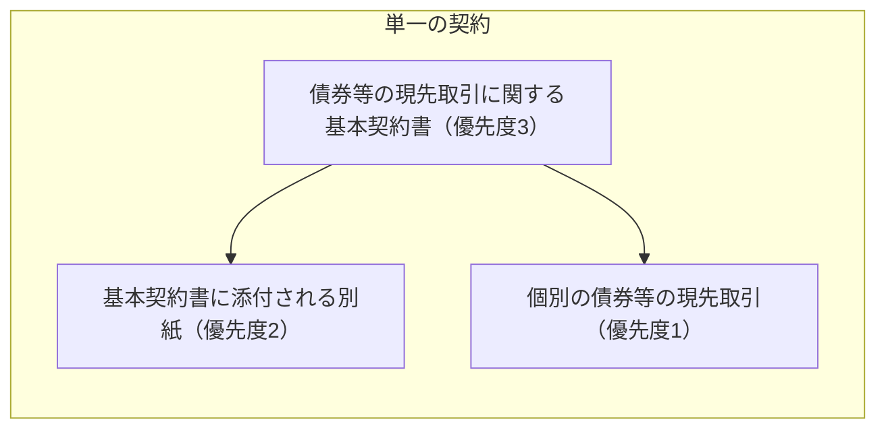
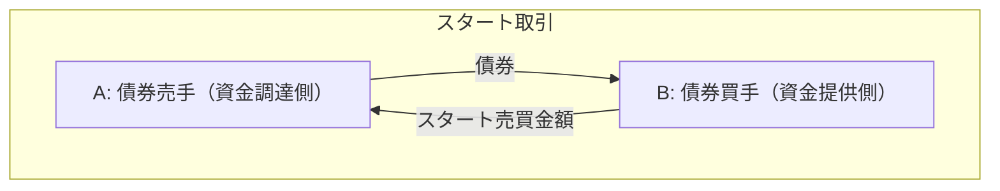
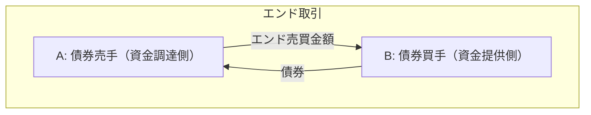

日証協の基本契約書のひな型をもとに、日本の現先取引についてみる。

## 契約の構造

## 取引

1. 取引が成立
2. 書面で契約内容の確認（コンファメーション）
3. スタート取引

4. エンド取引。エンド取引をもって取引が終了

## 権利の移転
金銭が支払われたら債券の権利が移転する。

## 担保
現先取引は、「純与信額がゼロ以上」となるように、消費貸借の形式で担保の請求ができる。
担保は担保金または担保証券のいずれか。
担保が担保金の場合は利息を付すことができる。
この利息の利率が担保金利率（リベート）である。

純与信額とは個別取引与信額の和から担保を差し引いた値である。
ここで、「個別取引与信額の和」とあることから、現先取引の担保のやり取りは各取引ごとではなく、取引相手ごとに行われる。

証券の買手からみた売手への個別取引与信額は次のように計算される。

$$
\begin{aligned}
① &= V_{end} \times (1+h) \\
② &= MV_{bond}(t) \times N_{bond} \\
Exposure(t) &= ① - ② \\ 
&= V_{end} \times (1+h) - MV_{bond}(t) \times N_{bond}
\end{aligned}
$$

売買金額算出比率はその定義から

$$
\begin{aligned}
h=\frac{MV_{bond}(0)}{P_{start}} - 1 \\
P_{start} = \frac{MV_{bond}(0)}{1+h}
\end{aligned}
$$

と表される。
式からもわかる通り、売買金額算出比率は取引開始時に定めた、債券の時価を現金相当額に換算するために、債券の時価を割ることで減じる値である。
すなわち、除算型のヘアカットである。

個別与信額の①の部分は将来買手に戻ってくる現金の債券の時価相当額であり、②の部分は時点$t$で買手の手元にある債券の時価総額である。
したがって$Exposure(t) \geq 0$は債券の買手に未実現利益がある状態である。
この未実現利益を補填するために、証券の買手は売手に対して担保を請求できる。
簡単のため1取引しかないとすると、個別取引与信額から受け取った担保の額を減じることにより、純与信額は

$$
Credit(t) = Exposure(t) - Collateral(t) = V_{end} \times (1+h) - MV_{bond}(t) \times N_{bond} - Collateral(t)
$$

と計算される。
「純与信額が零以上となるよう担保の差入れ又は返戻を請求することができる」とは

$$
\begin{aligned}
Credit(t) & \geq 0 \\ 
Exposure(t) - Collateral(t) & \geq 0 \\
Exposure(t) & \geq Collateral(t)
\end{aligned}
$$

より、証券の買手が売手に差入れの請求できる担保の額は与信額以下までということである。
証券の買手が受け取っている担保の額が変動し与信額を超えたら、純与信額が0以下になるので、売手は純与信額が0以上になるように担保の返戻を請求することができる。

|記号|意味|
|---|---|
|$V_{end}$|エンド売買金額。取引で決まるため固定|
|$h$|売買金額算出比率。0以上。取引で決まるため固定|
|$MV_{bond}(t)$|時点$t$における債券の市場価値|
|$N_{bond}$|債券の枚数。取引で決まるため固定|
|$Exposure(t)$|時点$t$における、証券の買手から見た売手への与信額|
|$P_{start}$|スタート取引における債券の単価。経過利子を含む。取引で決まるため固定|
|$Collateral(t)$|証券の買手が売手から受け取った担保の額|
|$Credit(t)$|純与信額|

## 担保と信用リスク
与信額で気を付ける必要があるのが、
1. キャッシュや債券のフローの現在価値を計算しているわけではないということ
2. 担保の時価を時価をそのまま使用しており、担保の過不足を見るもの。現金がどれだけ損失しうるかといった現金に主眼を置いた値ではないということ

である。
現先はデリバティブと異なり、取引期間が短いため現在価値への割引の影響はそこまで多くないだろう。
現金に主眼を置いた値を計算するには、エンド売買金額から売買金額算出比率の項を外し、債券時価をその項で除せばよい（ヘアカットを適用すればよい）。
すなわち、

$$
\begin{aligned}
CashExposure(t) &= \frac{Exposure(t)}{1+h} \\
&= V_{end} - \frac{MV_{bond}(t)}{1+h} \times N_{bond} \\
\end{aligned}
$$

|記号|意味|
|---|---|
|$CashExposure(t)$|時点$t$における、現金に主眼を置いた、証券の買手から見た売手への与信額|

担保がすべて担保金だとみなすと、現金に主眼を置いた純与信額は

$$
\begin{aligned}
CashCredit(t) &= CashExposure(t)- CashCollateral(t) \\
&= V_{end} - \frac{MV_{bond}(t)}{1+h} \times N_{bond} - CashCollateral(t) \\
\end{aligned}
$$

|記号|意味|
|---|---|
|$CashCollateral(t)$|時点$t$における証券の買手が売手から受け取った担保金|
|$CashCredit(t)$|時点$t$における、現金に主眼を置いた、証券の買手から見た売手への純与信額|

## 担保のサブスティテューション
既に差し入れている担保証券を新しい担保証券に差し替えることができる。

## 取引のリプライシング
元の取引のエンド取引受渡日を再評価日として取引を終了させ、その他条件は元の取引のまま再評価日をスタート取引受渡日として新しい取引を開始することができる。
再評価日において未実現利益と担保が相殺されて、相殺後の額が決済されるので純与信額を解消することができる。
デリバティブでいうSTM(Settled-to-Market)である。

## 期中の債券からの収益
現先取引で売買している債券の利払いがあった場合には、債券の買手から債券の売手に利金の相当額が支払われる。
担保として差し入れられている債券の利払いがあった場合には、担保として債券を受けている側が担保を差し出している側に利金の相当額が支払われる。
一般に、この利金の相当額の支払いはマニュファクチャードペイメント(manufactured payment)と呼ばれる。

## 売買している債券のサブスティテューション
現先取引で売買している債券も差し替えることができる。

## 別紙1 スタート売買金額の算出
スタート売買金額およびスタート売買単価を数式で表すと次の通り。
売買金額算出比率を決めれば、スタート売買単価が決まる。

$$
\begin{aligned}
V_{start} &= N_{bond} \times P_{start} \\
P_{start} &= \frac{MV_{bond}(0)}{1+h}
\end{aligned}
$$

|記号|意味|
|---|---|
|$V_{start}$|スタート売買金額|

## 別紙1 エンド売買金額
エンド売買金額およびエンド売買単価を数式で表すと以下の通り。

$$
\begin{aligned}
V_{end} &= N_{bond} \times P_{end} \\
P_{end} &= P_{start} + r \times P_{start} \times \frac{T}{365} \\
&= \left(1+r \times \frac{T}{365}\right) \times P_{start}
\end{aligned}
$$

|記号|意味|
|---|---|
|$r$|現先レート|
|$P_{end}$|エンド売買単価|
|$T$|取引終了日。$t=0$に取引開始とすると取引の満期（=約定期間）|

与信額は

$$
\begin{aligned}
Exposure(t) &= V_{end} \times (1+h) - MV_{bond}(t) \times N_{bond} \\
&= N_{bond} \times \left(1+r \times \frac{T}{365}\right) \times P_{start} \times (1+h) - MV_{bond}(t) \times N_{bond} \\
&= N_{bond} \times \left[\left(1+r \times \frac{T}{365}\right) \times MV_{bond}(0) - MV_{bond}(t)\right] 
\end{aligned}
$$

と書くことができる。
取引中に債券の利払いが無く、債券利回りが変化せず、フラットなイールドカーブを仮定すると、時点$t$の債券時価は債券利回り$r_{bond}$を用いて、

$$
MV_{bond}(t) = \left(1+r_{bond}\right)^{\frac{T}{365}} \times MV_{bond}(0) \approx \left(1+r_{bond} \times \frac{T}{365}\right) \times MV_{bond}(0)
$$

と近似できるから、与信額は

$$
Exposure(t) \approx N_{bond} \times \left( r - r_{bond} \right) \times \frac{T}{365} \times MV_{bond}(0)
$$

と表せる。
現先レートと債券利回りの差分が債券の買手の利益になる。

## 別紙1 オープンエンド
取引開始時には取引の終了日を決めないオープンエンド取引も行うことができる。

## 別紙２ 銘柄後決め現先
取引開始時には具体的な銘柄は決めずに、銘柄の種類のバスケットだけ決めた現先取引を行うことができる。

## 別紙4 非利含み現先取引
ここまで、債券の売買単価は経過利子を含んだ価格の取引を想定していたが、経過利子を含まない価格の取引も行うことができる。

## 規則 対象顧客
現先取引の対象となる顧客について、相手の状況に留意する旨が規則によって定められている。

## 規則 対象債券
現先取引の対象にできる債券は規則で定められている。
（市場が生まれるかは別にして）ABSとかは取引できなさそう。

## リーガルオピニオン
この基本契約書についてのリーガルオピニオンが取得されているのかは不明。

## 現先取引のベストプラクティス
日証協に現先取引のベストプラクティスが公表されている。
- [債券現先取引等研究会](https://market.jsda.or.jp/shijyo/saiken/chousa/kenkyukai/index.html)
  - 新現先取引Best Practice Guide（第4版）

## 参考
- [自主規制規則・債券関係](https://www.jsda.or.jp/shijyo/seido/jishukisei/web-handbook/106_saiken/index.html)
  - 債券等の条件付売買取引の取扱いに関する規則
  - 「債券等の現先取引に関する基本契約書」（参考様式）