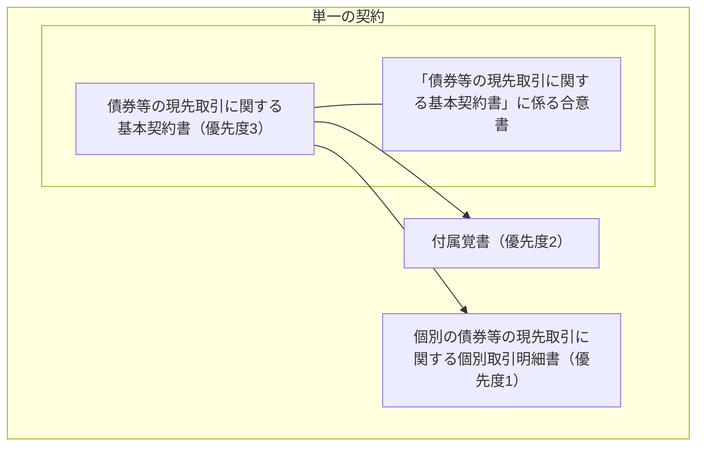

2016/07以前の新現先取引の基本契約書を2016/07以降と比較する。

## 契約の構造

2016/07以降と異なり合意書というのが別途あるよう。
また、個別取引の契約ではなく、個別取引明細書になっている

## 定義
定義の違いについて列挙する。

|用語|2016/07以降|2016/07以前|
|---|---|---|
|エンド売買単価|別紙1で定義されている|基本契約の本体で定義されている|
|エンド取引受渡日|個別現先取引で定める日|個別取引明細書に定める日|
|エンド売買単価|別紙1で定義|基本契約本体で定義|
|エンド売買金額|別紙1で定義|基本契約の本体で定義|
|個別取引明細書|契約の内容を記載した書面|合意内容を記載した書面|
|債務不履行時時価総額|有価証券|証券|
|時価|経過利子を含む額面100％当たりの市場価格|経過利子を含まない額面100％当たりの市場価格|
|時価総額|時価に数量を乗じた価額|時価に経過利子を加算したものに数量を乗じた価額|
|収益金|有価証券|証券|
|収益金基準日|新しく定義。登録制度に加え振替制度も判定の対象に加えている||
|収益金支払日||権利が確定する日が含まれている|
|純与信額|未払いの担保金利息を含む スタート取引受渡日とエンド取引受渡日の計算方法を明確化|担保金利息を含む|
|スタート売買単価|別紙1で定義|基本契約の本体で定義|
|スタート売買金額|別紙1で定義|基本契約の本体で定義|
|担保金利率|各別紙において定める|当事者間で別途定める|
|担保証券|各別紙において定めた有価証券|両当事者間で合意された証券|
|取引数量|個別現先取引で定めるもの|個別取引明細書で定めるもの|
|取引約定日|個別現先取引が成立した日|個別現先取引を約定した日|
|売買単価|経過利子を含む額面100％当たりの価額割合|経過利子を含まない額面100％当たりの価額割合|

- エンド取引受渡日の定義でも、契約ではなく明細書という書面が重要視されているよう
- 個別取引明細書の契約と合意の違いは何を反映したかったのだろか
- 証券という表記が有価証券に変わっているが、単に用語の修正なのだろうか
- 2016/07以降では時価はダーティ価格を指していたが、以前ではクリーン価格を指している。これはかなり大きい変更
- 時価総額に関してはともにダーティ
- 担保金利率は別紙で定めることによってデフォルトの値を設定できるようになったということなのだろうか
- 合意の内容が大体同じだったから、別紙というテンプレートを作成したのかもしれない

## スタート売買金額
旧現先の定義では

$$
\begin{aligned}
V_{start} &= N_{bond} \times P_{start,clean} + N_{bond} \times AI_{start} \\
P_{start,clean} &= \frac{MV_{start,clean} + AI_{start}}{1+h} - AI_{start}
\end{aligned}
$$

と表される。

|記号|意味|
|---|---|
|$V_{start}$|スタート売買金額|
|$N_{bond}$|取引数量|
|$P_{start,clean}$|スタート売買単価（クリーン価格）|
|$AI_{start}$|スタート取引受渡日における経過利子|
|$MV_{start,clean}$|約定時点の債券の時価（クリーン価格）|
|$h$|売買金額算出比率|

式を整理すると

$$
\begin{aligned}
V_{start} &= N_{bond} \times \left( \frac{MV_{start,clean} + AI_{start}}{1+h} - AI_{start} \right) + N_{bond} \times AI_{start} \\
 &= N_{bond} \times \frac{MV_{start,clean} + AI_{start}}{1+h} \\
 &= N_{bond} \times \frac{MV_{start,dirty}}{1+h}
\end{aligned}
$$

となるので、2016/07以降の値と一致する。
時価や単価の定義はクリーンだけど結局ダーティでやり取りしていたということか。

|記号|意味|
|---|---|
|$MV_{start,dirty}$|約定時点の債券の経過利子を含む価格（ダーティ価格）|

## エンド売買金額

$$
\begin{aligned}
V_{end} &= N_{bond} \times P_{end,clean} + N_{bond} \times AI_{end} \\
P_{end,clean} &= \left( P_{start,clean} + AI_{start} \right) + r \times \frac{P_{start,clean} \times T + AI_{start} \times T}{365} - AI_{end}
\end{aligned}
$$

と表される。

|記号|意味|
|---|---|
|$V_{end}$|エンド売買金額|
|$P_{end,clean}$|エンド売買単価（クリーン価格）|
|$AI_{end}$|エンド取引受渡日における経過利子|
|$r$|現先レート|
|$T$|約定期間|

式を整理すると

$$
\begin{aligned}
V_{end} &= N_{bond} \times \left[ \left( P_{start,clean} + AI_{start} \right) + r \times \frac{P_{start,clean} \times T + AI_{start} \times T}{365} - AI_{end} \right] + N_{bond} \times AI_{end} \\
 &= N_{bond} \times \left( 1 + r \times \frac{T}{365} \right) \frac{MV_{start,dirty}}{1+h}
\end{aligned}
$$

となるので、こちらも2016/07以降の値と一致する。

## 担保の管理
「少なくとも純与信額と同額又は同価値」と記載されている。
「純与信額が零以上」と記載されていた2016/07以降と比べると、旧現先では純与信額を負の値にするように多めに担保を取るということかと思われる。
担保を多くとり純与信額が負になると、相手方からみた純与信額は正になり担保が請求できるようになる。
結局純与信額が0になる程度で担保のやり取りが行われる。

## 担保のサブスティテューション
2016/07以降と同様、既に差し入れている担保証券を新しい担保証券に差し替えることができる。

## 証券からの収益金
取引期間中の債券からの利払いは債券の買手が受け取れる。2016/07以降とは異なる。
担保証券については、2016/07以降と同様、担保を差し入れている側に返す必要がある。

## 売買している債券のサブスティテューション
2016/07以降と同様、取引で売買している債券を差し替えることができる。

## 合意書 利含み現先
利含み現先を行うことができる。
この場合、単価や時価の定義も2016/07以降と一致する。
利含み現先では、オープンエンド取引も行うことができるほか、証券からの収益金は売手に返す必要がある。

## 参考
- [債券等の現先取引に関する基本契約書（参考様式）について](https://market.jsda.or.jp/shijyo/saiken/kessai/jgb_kentou/kihonkeiyakusho.html)
  - 旧基本契約書参考様式