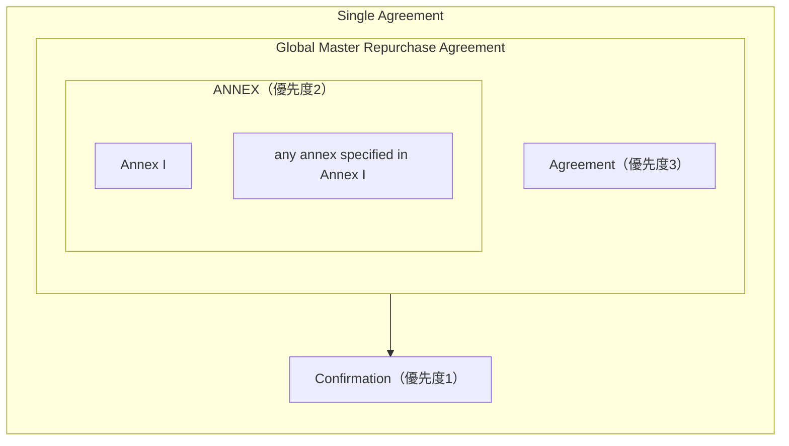

GMRAをもとに、GMRAのレポについてみる。

## 取引
- BuyerからSellerへのthe purchase priceの支払いに対してSellerからBuyerにSecuritiesを売る

と同時に、
- あらかじめ決められた日付もしくは要求があり次第、SellerからBuyerへのthe repurchase priceの支払いに対してBuyerがSellerにSecuritiesを売る契約を結ぶ

という取引。

日証協は別紙でオープンエンドの扱いを規定しているが、GMRAでは基本契約の最初にon demandと記載がある。

## 契約の構造
Transactionには
- Repurchase Transaction
- Buy/Sell Back Transaction
の2つがある。

Transactionの内容が書かれた確認書の事をConfirmationという。

## Margin Percentage
担保証券(Margin Securities)に適用されるパーセント値。

## Margin Ratio
買われる証券(the Purchsed Securities)の取引開始時の市場価値を購入価格(the Purchase Price)で割った値。
複数の証券を売買する場合にはそれぞれに異なるMargin Ratioを適用することができる。
数式で表すと、

$$
MR = \frac{MV(0)}{P_{start}}
$$

|記号|意味|
|---|---|
|$MR$|マージンレシオ|
|$MV(t)$|時点$t$の買われる証券の市場価値|
|$P_{start}$|購入価格|

## Transaction Exposure
Annex Iで指定される次のメソッド(A)またはメソッド(B)に従って計算される値$E$のこと。

### メソッド(A)
$$
E = R \times MR - MV
$$

|記号|意味|
|---|---|
|$R$|再購入価格(the Repurchase Price)|
|$MV$|証券の市場価値$(=MV(t))$|

$E$が0より大きい場合、Buyerが$E$だけTransaction Exposureをもつ。
$E$が0以下の場合、Sellerが$E$の絶対値だけTransaction Exposureをもつ。

メソッド(A)は債券の時価に主眼を置いた計算方法である。

### メソッド(B)
$$
E = R - V
$$

|記号|意味|
|---|---|
|$V$|証券の調整された価格(the Adjusted Value)|

調整された価格とは、

$$
MV(1-H)
$$

のことである。

|記号|意味|
|---|---|
|$H$|証券の市場価値からの割引である"ヘアカット"|

$E$が0より大きい場合、Buyerが$E$だけTransaction Exposureをもつ。
$E$が0以下の場合、Sellerが$E$の絶対値だけTransaction Exposureをもつ。

ヘアカットは本文中でも"haircut"と書かれており、本文のDefinitionsでもAnnex Iでも定義されていない。
GMRAのひな型におけるヘアカットとはあくまで当事者間で合意される何らかの値であり、ヘアカットを用いるにはAnexなどに定義等を追記する必要があると思われる。

メソッド(B)は現金に主眼を置いた計算方法である。

## Margin Maintenance
一方の当事者が他方の当事者に対してNet Exposureがある場合、他方の当事者に対してNet Exposureまでの額のMargin Transferを要求することができる。
- 一当事者のTransaction Exposureの和と一当事者に対する未払いの支払い額から、一当事者に提供されているNet Marginを差し引いた値
が、
- 他当事者のTransaction Exposureの和と他当事者に対する未払いの支払い額から、他当事者に提供されているNet Marginを差し引いた値

を超過している場合に、一当事者がNet Exposureがあるという。
Net MarginはCash Marginの額とMargin SecuritiesのMarket Value（Margin Percentage込み）の和である。

取引ごとではなく取引相手ごとに担保を授受することが分かる。
Net ExposureもNet Marginもグロスでの決済が想定された書き方になっているように見える。

## Income Payments
証券(Securities subject to that Transaction)からの収入が取引期間中に発生した場合には、BuyerからSellerに同額を支払う。
Margin Securitiesの収入の場合も、Margin Securitiesを受け取っている側がMargin Securitiesを差し出している側に支払う。

## Substitution
Purchased SecuritiesをNew Purchased Securitiesに差し替えることができる。
Margin Securitiesも同様。

## リーガルオピニオン
ICMAが取得したリーガルオピニオンが公開されている。Japanもあるようだが、ICMAの会員でないと閲覧できない。
- [About the GMRA Legal Opinions](https://www.icmagroup.org/market-practice-and-regulatory-policy/repo-and-collateral-markets/legal-documentation/icma-gmra-legal-opinions/)

## 参考
- [Global Master Repurchase Agreement (GMRA)](https://www.icmagroup.org/market-practice-and-regulatory-policy/repo-and-collateral-markets/legal-documentation/global-master-repurchase-agreement-gmra/)
  - GMRA 2011