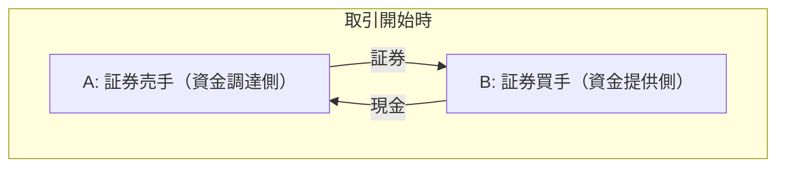
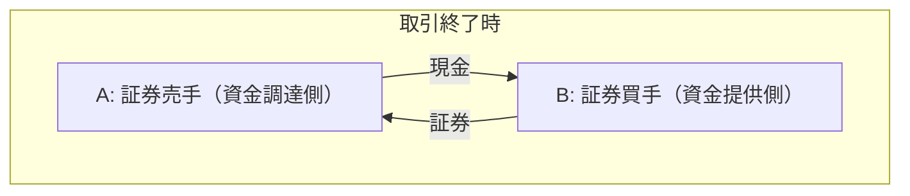
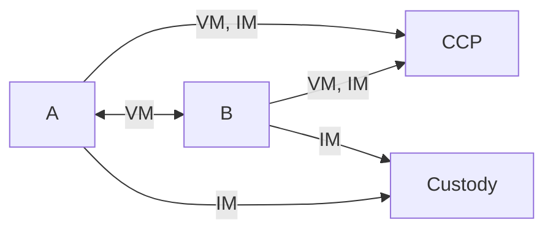

## レポ取引とは

レポ取引(Repurchase agreement, Repo)とは一定期間後に証券を買い戻す取引である。
証券を売ったときの価格で買い戻すわけではなく、利息を含めて買い戻す。

証券を売る側としては、
- 証券を担保として現金を調達する
- 手元の証券を使って追加のリターンを得る
証券を買う側としては、
- 手元の現金からリターンを得る（=レポ市場で運用する）
- 特定の証券を一定期間所有する

といった目的がある。
したがって、証券を売る側は資金を調達する側であるし、証券を買う側は資金を提供する側である。

リバースレポ取引(Reverse repo agreement)は単にレポ取引の視点を変えただけであり、証券を売り戻す取引を指す。
あるレポ取引は、証券を買い戻す側（上図のA）から見たらレポ取引であり、証券を売り戻す側（上図のB）からしたらリバースレポ取引である。

## レポとデリバティブ
CCPで清算されるデリバティブを取引すると、CCPにVM(変動証拠金)とIM(変動証拠金)を入れる必要がある。
相対のデリバティブを取引するとVMが必要になり、当事者が大きい金融機関だとIMも必要になる。
VMはキャッシュが多く、IMはキャッシュやHQLA(High Quality Liquid Asset)、最近では社債のこともある。
VMやIMとして授受する担保の調達がレポを含む短期金融市場で行われる。

デリバティブの原資産のボラティリティが高まると、VMやIMが大きくなり、VMやIMのための担保をレポ市場で調達しようとするため、レポ市場が動く。
デリバティブの原資産と担保の相関が小さいうちは問題ないが、相関が高くなってくると、レポ市場の動きがデリバティブの時価に影響を与えVMやIMがさらに大きくなる。
そうすると担保をまたレポ市場で調達しようとするので、さらにレポ市場が動く。
デリバ→レポ→デリバ→レポ→...という負のスパイラルに陥ることがある。

## レポ取引に関する文書
- [Repo market functioning](https://www.bis.org/publ/cgfs59.htm)
- [Vulnerabilities in Government Bond-backed Repo Markets](https://www.fsb.org/2026/02/vulnerabilities-in-government-bond-backed-repo-markets/)
