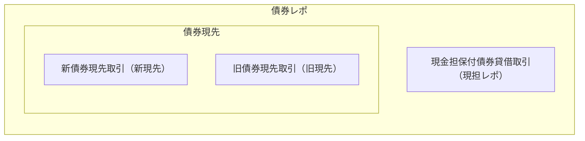
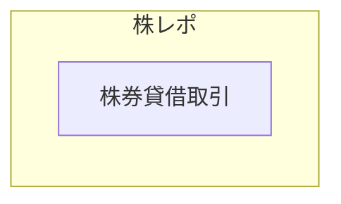

日本のレポ取引の形態について記載する。
もちろん、日本の金融機関が日本でグローバルなレポを扱うことも可能であるが、ここでは割愛する。

## 債券
買い戻す取引という意味では、レポ取引に相当するのは債券現先取引（債券等の条件付売買取引）である。
現先取引は債券しかないので、債券をとって単に現先と書かれる。
一方で、現金を担保に債券を貸借する取引である現金担保付債券貸借取引は買い戻す取引の現先と同様の経済効果があり、現先ではなく現金担保付債券貸借取引が行われることがある。
現金担保付債券貸借取引は現担レポと呼ばれている。
日本で債券レポといった場合には、債券現先取引と現金担保付債券貸借取引の両方が含まれる。
レポの中に貸借が含まれるという非常に混乱を生む呼び方である。
債券現先は商品が生まれてから制度変更があり、制度変更前の現先と制度変更後の現先がある。
今の制度変更後の現先に対して制度変更前の現先を旧現先と呼んだり、制度変更前の現先に対して今の制度変更後の現先を新現先と呼んだりすることがある。

このような形になっているのはもちろん歴史的経緯による。
旧現先が生まれて取引が拡大するも、短期金融市場で別の魅力的な商品が生まれ、旧現先は税やリスク管理の面から商品としての競争力を失った。
現担レポが登場し旧現先からシフトした。その後旧現先の制度を改正し、新現先が登場。しかし、新現先へ完全に移行したわけではなく、現在は旧現先、現担レポ、新現先の3つが残っている。

## 株式
日本で株レポといった場合には、株券貸借取引（株券等の貸借取引）を表す。
債券の現担レポと同様に、株レポはレポと同等の経済効果を持つ貸借として普及したためである。

## 参考
- 東京マネーマーケット
- [日証協　自主規制規則・債券関係](https://www.jsda.or.jp/shijyo/seido/jishukisei/web-handbook/106_saiken/index.html)