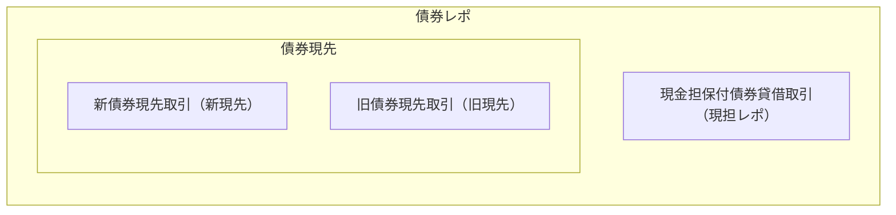
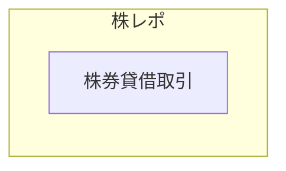

日本のレポ取引の形態について記載する。
もちろん、日本の金融機関が日本でグローバルなレポを扱うことも可能であるが、ここでは割愛する。

## 債券
買い戻す取引という意味では、レポ取引に相当するのは債券現先取引（債券等の条件付売買取引）である。
現先取引は債券しかないので、債券をとって単に現先と書かれる。
一方で、現金を担保に債券を貸借する取引である現金担保付債券貸借取引は買い戻す取引の現先と同様の経済効果があり、現先ではなく現金担保付債券貸借取引が行われることがある。
現金担保付債券貸借取引は現担レポと呼ばれている。
日本で債券レポといった場合には、債券現先取引と現金担保付債券貸借取引の両方が含まれる。
レポの中に貸借が含まれるという非常に混乱を生む呼び方である。
債券現先は商品が生まれてから制度変更があり、制度変更前の現先と制度変更後の現先がある。
今の制度変更後の現先に対して制度変更前の現先を旧現先と呼んだり、制度変更前の現先に対して今の制度変更後の現先を新現先と呼んだりすることがある。

このような形になっているのはもちろん歴史的経緯による。
旧現先が生まれて取引が拡大するも、短期金融市場で別の魅力的な商品が生まれ、旧現先は税やリスク管理の面から商品としての競争力を失った。
現担レポが登場し旧現先からシフトした。その後旧現先の制度を改正し、新現先が登場。しかし、新現先へ完全に移行したわけではなく、現在は旧現先、現担レポ、新現先の3つが残っている。

### 参考
- 東京マネーマーケット
- [日証協 自主規制規則・債券関係](https://www.jsda.or.jp/shijyo/seido/jishukisei/web-handbook/106_saiken/index.html)
- [日証協 自主規制規則・株式関係](https://www.jsda.or.jp/shijyo/seido/jishukisei/web-handbook/105_kabushiki/index.html)
- [日銀 現先取引の整備・拡充に向けた動きについて](https://www.boj.or.jp/research/wps_rev/mkr/kmr01j09.htm)
- [日銀 国債決済期間短縮（T+1）化後の市場取引動向](https://www.boj.or.jp/research/brp/ron_2019/ron190530a.htm)

## 株式
- 日本で株レポといった場合には、株券貸借取引（株券等の貸借取引）を表す
- 債券の現担レポと同様に、株レポはレポと同等の経済効果を持つ貸借として普及したためである

## 清算
- 国債の債券レポはJSCCで中央清算される
- 銘柄後決めレポについては、新現先のみ対象
  - 新現先のみ対象とすることで、新現先への移行を促している
- 現先と現担レポがネットされる
  - JSCCとは1つの基本契約のもとでレポと貸借を契約しているようなもの

>（ネッティング口座）
>第８６条 清算参加者は、参加者決済に係る支払債務の履行に伴う金銭の授受その他本業
務方法書に基づき当社との間で行う金銭又は国債証券の授受について、すべてネッティ
ング口座で処理するものとする。
>２ ネッティング口座は、通常口座、レポ専用口座及び後決めレポ専用口座の３種類とし、
それぞれ次の各号に定めるものとする。
>（１） 通常口座は、すべての清算対象取引に関し、前項に規定する処理を行うことの
できる口座とする。
>（２） レポ専用口座は、現金担保付債券取引等及び現先取引等（第４４条第１項第２
号ｂ、同項第３号ｂ若しくはｃ又は第４５条第１項第２号ｂ若しくは同項第３号ｂの
規定により債務の引受けが行われる取引を除く。）に関し、前項に規定する処理を行う
ことのできる口座とする。
>（３） 後決めレポ専用口座は、銘柄後決め現先取引等に関し、前項に規定する処理を
行うことのできる口座とする。
>３ 清算参加者は、ネッティング口座の開設に際し、当社の定めるところにより、ネッテ
ィング口座ごとにネッティング口座の種類を当社に届け出なければならない。
>４ 信託の受託者である清算参加者は、自己が受託する信託に係る取引については、信託
口で処理しなければならない。

### 参考
- [JSCC 国債店頭 取引清算対象取引](https://www.jpx.co.jp/jscc/seisan/tentou/product.html)
- [JSCC 規則 国債店頭取引](https://www.jpx.co.jp/jscc/kisoku/tentou.html)
  - 国債店頭取引清算業務に関する業務方法書
  - 国債店頭取引清算業務に関する業務方法書の取扱い

## 取引動向
日本のレポ取引の動向については、日銀が集計したデータを公表している。
どのようなデータがなのかは[「FSBレポ統計の日本分集計結果」の解説](https://www.boj.or.jp/statistics/outline/exp/exrepo.htm)にて説明されている。

|項目|内容|
|---|---|
|対象取引|日本の「レポ」 狭義レポについては現先だけでなくMRA、GMRA、その他基本契約書  貸借取引については、日証協の貸借（債券と株券）、MSLA、GMSLA、その他基本契約書。ただし無担保貸借と制度信用取引の貸借は含まれない|
|公表頻度|月次。翌月第15営業日|
|公表されているデータ|ストックデータ・フローデータ 金融機関のサイド 証券種類 マチュリティ（取引満期） 取引相手の法域 取引相手の業態 GCレポ取引/SCレポ取引 CCP清算取引/非CCP清算取引 レート（貸借料率・レポレート）|

### 参考
- [FSBレポ統計の日本分集計結果](https://www.boj.or.jp/statistics/bis/repo/index.htm)
- [「FSBレポ統計の日本分集計結果」の解説](https://www.boj.or.jp/statistics/outline/exp/exrepo.htm)
- [「FSBレポ統計の日本分集計結果」の公表開始に関するお知らせ](https://www.boj.or.jp/statistics/outline/notice_2020/not200110a.htm)

