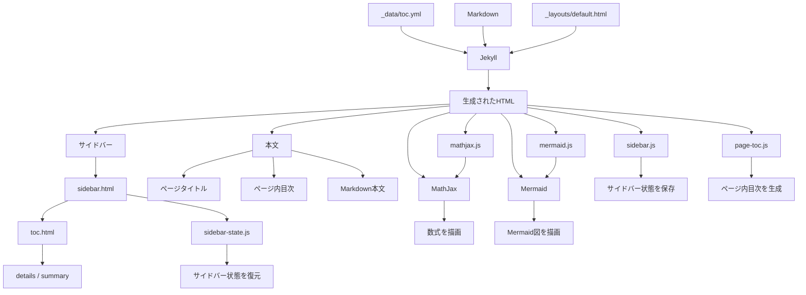
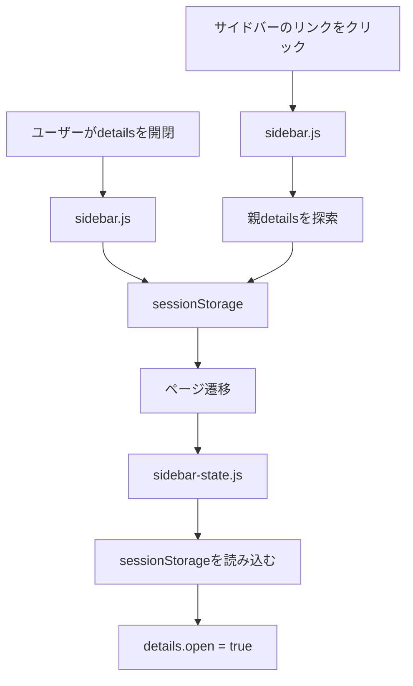
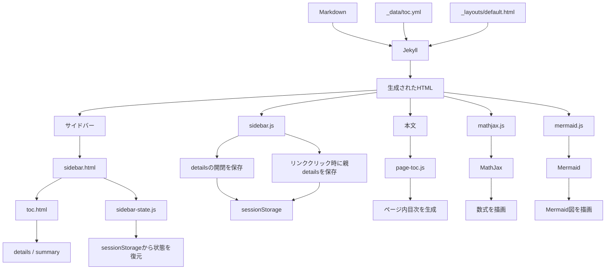

このサイトは、JekyllによってMarkdownから静的HTMLを生成し、ブラウザ上のJavaScriptによって動的な処理を追加する構成になっている。

コンテンツ、サイト全体のナビゲーション、ページレイアウト、ブラウザ上の動作を分離することで、各機能を独立して管理できるようにしている。

## 全体構成



## ディレクトリ構成

ページの生成と表示に関係する主なファイルは以下の通り。

```text
finance/
├── _config.yml
├── _data/
│   └── toc.yml
├── _includes/
│   ├── sidebar.html
│   └── toc.html
├── _layouts/
│   └── default.html
├── _contents/
│   └── ...
└── assets/
    ├── css/
    │   ├── ...
    │   └── ...
    └── js/
        ├── sidebar.js
        ├── sidebar-state.js
        ├── page-toc.js
        ├── mathjax.js
        └── mermaid.js
```

`_contents` にはページ本文が置かれ、`_data/toc.yml` にはサイト全体のナビゲーション構造が定義されている。

`_config.yml` では `contents` コレクションを公開し、URLを `/contents/:path/` としている。

## 1. Jekyllによるページ生成

各ページのMarkdownとJekyllのレイアウトをもとに、Jekyllが最終的なHTMLを生成する。

全体のページレイアウトは `default.html` で定義されている。

`default.html` では、サイドバーと本文を配置し、本文領域にはページタイトル、ページ内目次のコンテナ、Markdownから変換された本文を配置する。

```html
<main class="content">
  <h1>{{ page.title }}</h1>

  <div id="page-toc">
    <h2 class="toc-title">目次</h2>
  </div>

  {{ content }}
</main>
```

ここで、

* `{{ page.title }}` はページタイトル
* `{{ content }}` はMarkdown本文をHTMLに変換した結果

を表す。

Jekyllによる生成段階では、サイドバーや本文などの静的なHTML構造が作られる。

## 2. サイト全体のナビゲーション

サイト全体のナビゲーション構造は、本文とは分離して `_data/toc.yml` で管理している。

例えば、

```yaml
- name: レポ Repos
  href: /contents/repos/
  items:
    - name: 日本の「レポ」取引 Repos in Japan
      href: /contents/repos/repos_in_japan/
    - name: 現先取引（債券等の条件付売買取引） Gensaki
      href: /contents/repos/gensaki_new/
```

のように、`items` を使って階層構造を表現する。

このため、ナビゲーションの構造を変更する場合でも、各ページのMarkdownを変更する必要がない。

## 3. サイドバーの生成

`default.html` から `sidebar.html` を読み込む。

```liquid
<aside class="sidebar">
  
</aside>
```

`sidebar.html` では、`site.data.toc` を `toc.html` に渡す。

```liquid

```

したがって、サイドバーの生成は、

```text
_data/toc.yml
      ↓
site.data.toc
      ↓
sidebar.html
      ↓
toc.html
      ↓
サイドバーのHTML
```

という流れになる。

## 4. toc.htmlによる階層構造の生成

`toc.html` は渡された項目を再帰的に処理する。

子項目を持つ場合は、`details` と `summary` を使用して折りたたみ可能な項目を生成する。

```liquid

  <details>
    <summary>
      
        <a href="{{ item.href | relative_url }}">{{ item.name }}</a>
      
        {{ item.name }}
      
    </summary>

    
  </details>

```

子項目について再び `toc.html` を呼び出すため、任意の深さの階層を表現できる。

例えば、

```text
レポ Repos
├── 日本の「レポ」取引
└── 現先取引

プライベートマーケット
└── 私募不動産
    └── 森林投資・農地投資
```

のような構造が生成される。

## 5. サイドバーの状態復元

サイドバーの展開状態を復元するのが `sidebar-state.js` である。

このスクリプトは `sidebar.html` の最後で読み込まれる。

```liquid
<script src="{{ '/assets/js/sidebar-state.js' | relative_url }}"></script>
```

サイドバーのHTMLが生成された直後に実行されるため、`DOMContentLoaded` を待たずに状態を復元できる。

各 `details` の直下にある `summary` 内のリンクの `href` をキーとして使用する。

```javascript
const link = detail.querySelector(":scope > summary a");
const key = link.getAttribute("href");
const storageKey = "sidebar-open:" + key;
```

`sessionStorage` に `"true"` が保存されていれば、

```javascript
if (sessionStorage.getItem(storageKey) === "true") {
    detail.open = true;
}
```

として対象の `details` を開く。

この処理をサイドバーHTMLの生成直後に行うことで、ページ表示後に一度閉じた状態を表示してから開くようなちらつきを避ける。

## 6. サイドバーの状態保存

`sidebar.js` は、ユーザーによるサイドバーの操作を `sessionStorage` に保存する。

保存処理は `DOMContentLoaded` 後に登録される。

```javascript
document.addEventListener("DOMContentLoaded", function () {
    const details = document.querySelectorAll(".sidebar details");

    // ...
});
```

各 `details` に `toggle` イベントを設定し、

```javascript
detail.addEventListener("toggle", function () {
    sessionStorage.setItem(storageKey, detail.open);
});
```

として現在の開閉状態を保存する。

保存キーは、

```text
sidebar-open:<リンクのhref>
```

である。

例えば、

```text
sidebar-open:/finance/contents/repos/
```

のようになる。

## 7. リンククリック時の親details保存

ページ遷移によって現在のHTMLは破棄されるため、子ページへのリンクをクリックする際には、そのリンクを含む親 `details` の状態も保存する。

`sidebar.js` はサイドバー内のリンクを監視し、クリックされたリンクから親要素を順に辿る。

```text
リンク
 ↓
親要素
 ↓
details
 ↓
さらに親要素
 ↓
details
```

見つかった各 `details` について、

```javascript
sessionStorage.setItem(storageKey, "true");
```

として展開状態を保存する。

例えば、

```text
レポ Repos
└── 日本の「レポ」取引
```

の「日本の『レポ』取引」をクリックした場合、「レポ Repos」が開いた状態として保存される。

階層がさらに深い場合も、すべての親 `details` が保存される。

そのため、子ページへ移動した後でも、それまで展開していた階層を維持できる。

## 8. sessionStorageによる状態管理

サイドバーの状態管理には `sessionStorage` を使用する。

これは、展開状態を永続的なユーザー設定ではなく、現在のブラウジングセッションにおけるUI状態として扱うためである。

```text
同じタブでページ遷移
        ↓
展開状態を維持

タブを閉じる
        ↓
状態を破棄
```

状態保存と復元の関係は以下の通り。



## 9. ページ内目次

ページ内の目次は `page-toc.js` によってブラウザ上で生成する。

`default.html` には、目次を挿入するためのコンテナをあらかじめ配置している。

```html
<div id="page-toc">
  <h2 class="toc-title">目次</h2>
</div>
```

`page-toc.js` は本文中の `h2` から `h6` を取得する。

```javascript
document.querySelectorAll(
    ".content h2, .content h3, .content h4, .content h5, .content h6"
)
```

ただし、目次自身のタイトルである `.toc-title` は除外する。

```javascript
.filter(heading => !heading.classList.contains("toc-title"));
```

なお、`querySelectorAll()` の戻り値を `Array.from()` に変換してから `filter()` を利用している。

取得した見出しをもとに、ネストした `<ul>` と `<li>` を生成する。

例えば、

```text
h2
├── h3
│   └── h4
└── h3
h2
```

という見出し構造から、

```text
・h2
  ・h3
    ・h4
  ・h3
・h2
```

というページ内目次を生成する。

見出しに `id` が存在しない場合は、

```javascript
heading.id = "heading-" + index;
```

としてIDを付与する。

生成した目次リンクは、このIDをリンク先として使用する。

```javascript
a.href = "#" + heading.id;
```

## 10. MathJax

数式の描画にはMathJaxを使用する。

`mathjax.js` でMathJaxの設定を定義する。

```javascript
window.MathJax = {
    tex: {
        tags: 'ams',
        inlineMath: [['$', '$'], ['\\(', '\\)']],
        displayMath: [['$$', '$$'], ['\\[', '\\]']]
    }
};
```

`default.html` ではこの設定ファイルを先に読み込み、その後MathJax本体をCDNから読み込む。

処理の流れは、

```text
Markdown
    ↓
数式を含むHTML
    ↓
mathjax.js
    ↓
MathJaxの設定
    ↓
MathJax本体
    ↓
数式を描画
```

となる。

## 11. Mermaid

Mermaid図は `mermaid.js` によってブラウザ上で描画する。

`default.html` では、Mermaid用スクリプトをES moduleとして読み込む。

```html
<script type="module" src="{{ '/assets/js/mermaid.js' | relative_url }}"></script>
```

`mermaid.js` はjsDelivrからMermaid 11を読み込み、

```javascript
import mermaid from 'https://cdn.jsdelivr.net/npm/mermaid@11/dist/mermaid.esm.min.mjs';

mermaid.initialize({ startOnLoad: true });
```

として初期化する。

その後、Markdownから生成されたMermaidコードブロックを検索する。

```javascript
document.querySelectorAll('code.language-mermaid')
```

取得したコードブロックを、

```html
<div class="mermaid">
  ...
</div>
```

に置き換える。

最後に、

```javascript
await mermaid.run();
```

を実行して図を描画する。

処理の流れは、

```text
Markdown
    ↓
Mermaidコードブロック
    ↓
code.language-mermaid
    ↓
mermaid.js
    ↓
<div class="mermaid">
    ↓
Mermaid
    ↓
SVGとして描画
```

となる。

## 12. ページレンダリングの流れ

以上をまとめると、ページの生成と描画は次のように分かれる。



つまり、このサイトは大きく、

```text
Jekyll
  ↓
静的なHTML構造を生成
  ↓
ブラウザ
  ├── サイドバー状態を復元
  ├── サイドバー状態を保存
  ├── ページ内目次を生成
  ├── 数式を描画
  └── Mermaid図を描画
```

という2段階で構成されている。

## 13. JavaScriptの役割分担

現在のJavaScriptは、機能ごとに責務を分離している。

```text
sidebar-state.js
    └── サイドバーの初期状態を復元

sidebar.js
    ├── サイドバーの開閉状態を保存
    └── リンククリック時に親detailsの状態を保存

page-toc.js
    └── ページ内目次を生成

mathjax.js
    └── MathJaxの設定

mermaid.js
    └── Mermaid図を描画
```

特にサイドバーについては、「状態の保存」と「状態の復元」を分離している。

```text
ユーザー操作
    ↓
sidebar.js
    ↓
sessionStorage
    ↓
ページ遷移
    ↓
sidebar-state.js
    ↓
<details>.open
```

また、`sidebar-state.js` をサイドバーHTMLの直後に配置することで、状態復元をできるだけ早い段階で行い、表示時のちらつきを抑えている。

## 14. 設計上の考え方

このサイトでは、コンテンツ、サイト構造、ページレイアウト、ブラウザ上の動作を分離している。

```text
Markdown
    ↓
コンテンツ

_data/toc.yml
    ↓
サイト全体の構造

Jekyll / Liquid
    ↓
HTML構造

CSS
    ↓
表示

JavaScript
    ↓
ブラウザ上の動作
```

この分離によって、

* 本文を変更する場合はMarkdownを編集する
* サイドバーの構造を変更する場合は`_data/toc.yml`を編集する
* ページ全体の構造を変更する場合は`default.html`を編集する
* ブラウザ上の動作を変更する場合は対応するJavaScriptを編集する

というように、変更箇所を明確にできる。

特に、サイドバー、ページ内目次、MathJax、Mermaidをそれぞれ別のJavaScriptファイルに分離することで、互いの処理が過度に依存しない構成としている。
