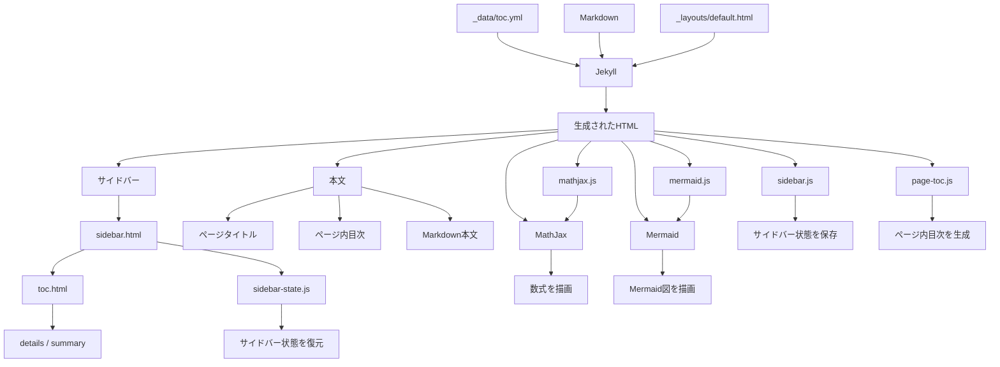
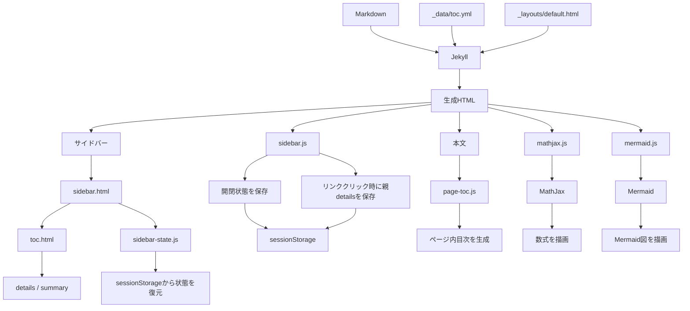

このサイトは、JekyllによってMarkdownから静的HTMLを生成し、ブラウザ上のJavaScriptによって動的な処理を追加する構成になっている。

基本的には、以下のように役割を分けている。

* Markdown：各ページの本文を記述する
* `_data/toc.yml`：サイト全体のナビゲーション構造を定義する
* Jekyll：MarkdownとテンプレートからHTMLを生成する
* CSS：ページの見た目を定義する
* JavaScript：サイドバーの状態管理、ページ内目次、数式、Mermaid図などのブラウザ側の処理を行う

## 全体構成



## ディレクトリ構成

ページの生成と表示に関係する主なファイルは以下の通り。

```text
finance/
├── _config.yml
├── _data/
│   └── toc.yml
├── _includes/
│   ├── sidebar.html
│   └── toc.html
├── _layouts/
│   └── default.html
├── _contents/
│   └── ...
└── assets/
    ├── css/
    │   └── ...
    └── js/
        ├── sidebar.js
        ├── sidebar-state.js
        ├── page-toc.js
        ├── mathjax.js
        └── mermaid.js
```

`_contents` に各ページのMarkdownコンテンツが置かれ、`_data/toc.yml` にサイト全体のナビゲーション構造が定義されている。

## 1. ページ本文

各ページの本文はMarkdownで記述する。

JekyllはMarkdownをHTMLに変換し、レイアウトの `{{ content }}` に挿入する。

`default.html` では、概ね以下の構造で本文を配置している。

```html
<main class="content">
  <h1>{{ page.title }}</h1>

  <div id="page-toc">
    <h2 class="toc-title">目次</h2>
  </div>

  {{ content }}
</main>
```

つまり、ページは、

```text
ページタイトル
    ↓
ページ内目次
    ↓
本文
```

という構造になる。

## 2. サイト全体の目次

サイドバーの構造は、ページごとのMarkdownとは分離して `_data/toc.yml` で管理している。

例えば、

```yaml
- name: レポ Repos
  href: /contents/repos/
  items:
    - name: 日本の「レポ」取引 Repos in Japan
      href: /contents/repos/repos_in_japan/
    - name: 現先取引（債券等の条件付買取取引） Gensaki
      href: /contents/repos/gensaki_new/
```

のように、`items` に子項目を指定することで階層構造を表現する。

このため、ナビゲーションの構造を変更しても、各ページのMarkdownを変更する必要はない。

## 3. サイドバーの生成

`default.html` から `sidebar.html` を読み込む。

```liquid
<aside class="sidebar">
  
</aside>
```

`sidebar.html` では、`site.data.toc` を `toc.html` に渡す。

```liquid

```

したがって、サイドバーは、

```text
_data/toc.yml
      ↓
site.data.toc
      ↓
sidebar.html
      ↓
toc.html
      ↓
サイドバーのHTML
```

という流れで生成される。

## 4. 階層構造の生成

`toc.html` は目次データを再帰的に処理する。

子項目を持つ項目については、HTMLの `<details>` と `<summary>` を使用して折りたたみ可能な項目を生成する。

```html
<details>
  <summary>
    <a href="...">...</a>
  </summary>

  ...
</details>
```

さらに、その子項目について `toc.html` を再帰的に呼び出す。

その結果、

```text
レポ Repos
├── 日本の「レポ」取引
└── 現先取引
```

のような階層構造が、ネストした `<details>` / `<summary>` としてHTMLに変換される。

この処理によって、サイト全体のナビゲーション構造が1つのYAMLファイルから生成される。

## 5. サイドバーの状態復元

サイドバーには、ページを移動しても展開状態を維持する仕組みがある。

状態の復元を担当するのが `sidebar-state.js` である。

`sidebar-state.js` は `sidebar.html` の中で、サイドバーのHTMLを生成した直後に読み込まれる。

```html
<nav class="sidebar-nav">
  ...
</nav>

<script src="{{ '/assets/js/sidebar-state.js' | relative_url }}"></script>
```

この位置で読み込むことが重要である。

サイドバーのHTMLが存在してから実行されるため、`DOMContentLoaded` を待つ必要がない。

各 `<details>` について、`summary` 内のリンクの `href` を状態管理用のキーとして利用する。

```javascript
const link = detail.querySelector(":scope > summary a");
const key = link.getAttribute("href");
const storageKey = "sidebar-open:" + key;
```

`sessionStorage` に保存された値が `"true"` の場合は、

```javascript
detail.open = true;
```

として `<details>` を展開する。

これによって、ページを読み込んだ段階から正しい展開状態にできる。

`DOMContentLoaded` の後に復元処理を行うと、一度閉じた状態で画面が表示された後に展開される可能性がある。そのため、サイドバーのHTML生成直後に復元処理を行っている。

## 6. サイドバーの状態保存

状態の保存を担当するのが `sidebar.js` である。

`sidebar.js` は `DOMContentLoaded` 後にサイドバーの `<details>` を取得し、`toggle` イベントを登録する。

```javascript
detail.addEventListener("toggle", function () {
    sessionStorage.setItem(storageKey, detail.open);
});
```

ユーザーがサイドバーを開閉すると、その時点の状態が `sessionStorage` に保存される。

保存に使用するキーは、

```text
sidebar-open:<リンクのhref>
```

である。

例えば、

```text
sidebar-open:/finance/contents/repos/
```

のようになる。

## 7. リンククリック時の親details保存

サイドバーでは、単に `toggle` の状態を保存するだけではなく、リンクをクリックしたときに、そのリンクを含む親 `<details>` の状態も保存する。

例えば、

```text
レポ Repos
└── 日本の「レポ」取引
```

という構造で「日本の『レポ』取引」をクリックした場合、ページ遷移によって現在のDOMは破棄される。

そこでリンククリック時に親の `<details>` を調べ、

```text
リンク
  ↓
親要素
  ↓
<details>
  ↓
さらに上の親要素
  ↓
<details>
```

と上方向に辿っていく。

見つかった親 `<details>` について、

```javascript
sessionStorage.setItem(storageKey, "true");
```

として展開状態を保存する。

これによって、子ページへ移動した後も、そこに至るまでのサイドバーの階層を開いた状態にできる。

## 8. sessionStorage

サイドバーの状態には `sessionStorage` を使用している。

これは、サイドバーの展開状態を永続的な設定ではなく、現在のブラウジングセッションにおけるUI状態として扱うためである。

```text
同じタブでページ移動
        ↓
展開状態を維持

タブを閉じる
        ↓
状態を破棄
```

したがって、ユーザーが別のページを閲覧しても同じタブであればサイドバーの状態を維持できる一方、タブを閉じれば状態はリセットされる。

## 9. ページ内目次

ページ内の目次は、サイドバーとは別にJavaScriptによって生成される。

`default.html` には、目次を挿入するための空の要素があらかじめ用意されている。

```html
<div id="page-toc">
  <h2 class="toc-title">目次</h2>
</div>
```

`page-toc.js` はページ読み込み後に本文中の、

```text
h2
h3
h4
h5
h6
```

を取得する。

ただし、目次自身のタイトルである `h2.toc-title` は除外する。

取得した見出しをもとに、

```text
h2
├── h3
│   └── h4
└── h3
h2
```

という見出し構造に対応したネストしたリストを生成する。

各見出しに `id` が存在しない場合には、JavaScriptによってIDを付与し、そのIDを目次リンクのリンク先として使用する。

例えば、

```html
<h2 id="heading-0">取引概要</h2>
```

に対して、

```html
<a href="#heading-0">取引概要</a>
```

というリンクを生成する。

これによって、ページ内目次から各見出しへ移動できる。

## 10. MathJax

数式の描画にはMathJaxを使用している。

`mathjax.js` でMathJaxの設定を定義し、その後MathJax本体を読み込む。

処理の流れは、

```text
Markdown
    ↓
数式を含むHTML
    ↓
mathjax.js
    ↓
MathJaxの設定
    ↓
MathJax本体
    ↓
数式を描画
```

となる。

MathJaxでは、インライン数式とディスプレイ数式について、`$...$`、`$$...$$` などの記法を利用できるように設定している。

## 11. Mermaid

Mermaidによる図も、ブラウザ側のJavaScriptで描画する。

Markdown中のMermaidコードは、JekyllによってコードブロックとしてHTMLに変換される。

`mermaid.js` はその中から、

```javascript
document.querySelectorAll('code.language-mermaid')
```

によってMermaidのコードブロックを検索する。

そのコードブロックを、

```html
<div class="mermaid">
  ...
</div>
```

に変換し、Mermaidを実行する。

処理の流れは、

```text
Markdown
    ↓
Mermaidコードブロック
    ↓
HTMLのcode.language-mermaid
    ↓
mermaid.js
    ↓
<div class="mermaid">
    ↓
Mermaid
    ↓
SVGとして描画
```

となる。

## 12. JavaScriptの役割分担

現在のJavaScriptは、機能ごとにファイルを分けている。

```text
sidebar-state.js
    └── サイドバーの初期状態を復元

sidebar.js
    ├── サイドバーの開閉状態を保存
    └── リンククリック時に親detailsの状態を保存

page-toc.js
    └── ページ内目次を生成

mathjax.js
    └── MathJaxの設定

mermaid.js
    └── Mermaid図を描画
```

特にサイドバーについては、状態の「保存」と「復元」を分離している。

```text
ユーザー操作
    ↓
sidebar.js
    ↓
sessionStorage
    ↓
ページ遷移
    ↓
sidebar-state.js
    ↓
<details>.open
```

この分離によって、それぞれのJavaScriptの責務を明確にしている。

## 13. ページレンダリングの流れ

ページ全体の処理をまとめると、以下のようになる。



つまり、このサイトでは、

```text
Jekyll
  ↓
静的なHTML構造を生成
  ↓
ブラウザ
  ├── サイドバー状態を復元
  ├── サイドバー状態を保存
  ├── ページ内目次を生成
  ├── 数式を描画
  └── Mermaid図を描画
```

という2段階の構成になっている。

## 14. 設計上の考え方

このサイトでは、コンテンツ、サイト構造、表示、ブラウザ上の動作をできるだけ分離している。

```text
Markdown
    ↓
コンテンツ

_data/toc.yml
    ↓
サイト構造

Jekyll / Liquid
    ↓
HTML構造

CSS
    ↓
表示

JavaScript
    ↓
ブラウザ上の動作
```

これにより、例えば本文を書き換える場合はMarkdownだけを編集し、サイドバーの構造を変更する場合は `_data/toc.yml` を編集すればよい。

また、ページ内目次やサイドバーの状態管理など、HTMLだけでは実現しにくい機能についてはJavaScriptに分離している。

このように、**Jekyllを静的なサイト生成、JavaScriptをブラウザ上の動的処理に使い分けることで、シンプルな構成を維持している。**
